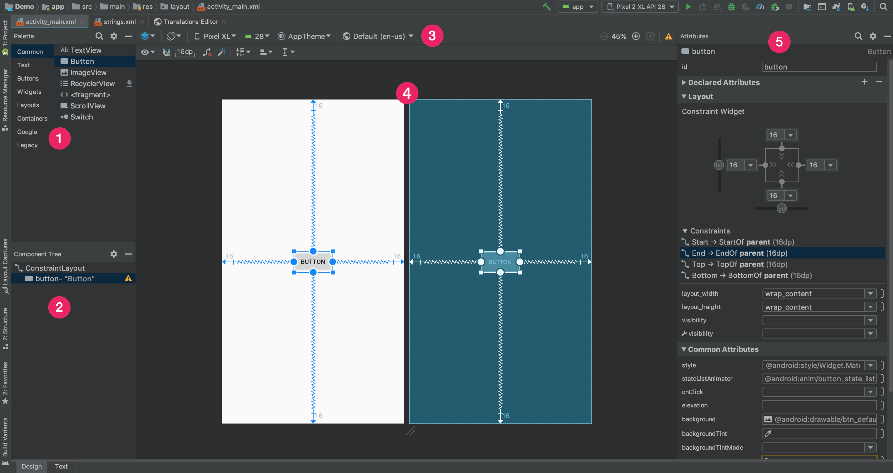

# Макеты

## Оглавление

- [Введение](#введение)
- [Редактор макетов](#редактор-макетов)
- [Добавление компонентов на макет с помощью редактора](#добавление-компонентов-на-макет-с-помощью-редактора)
  - [Добавление `TextView`](#добавление-textview)
  - [Создание стиля `TextView`](#создание-стиля-textview)
  - [Добавление `ScrollView`](#добавление-scrollview)
  - [Добавление `EditText`](#добавление-edittext)
  - [Добавление `Button`](#добавление-button)
- [Data Binding](#data-binding)
- [ConstraintLayout](#constraintlayout)
- [Ресурсы](#ресурсы)

## Введение

Документация на layouts: https://developer.android.com/guide/topics/ui/declaring-layout.

Макет определяет визуальную структуру пользовательского интерфейса, например, пользовательского интерфейса экрана или отдельного виджета. Существует два способа создания макета:
* Объявление элементов UI в XML. В Android имеется удобный способ описания XML-элементов для классов `View` и их подклассов.
* Программное создание экземпляров визуальных элементов путем наследования классов от `View` и его производных.

В Android все классы вызуальных элементов наследованы от `View`. От него унастледованы такие элементы как:
* `TextView` — компонент для отображения текста,
* `ImageView` — компонент для отображения изображения,
* `Button` — стандартная кнопка,
* `EditText` — компонент для ввода текста,
* и другие компоненты, такие как `CheckBox`, `Slider`, `Menu` и др.

Для размешения нескольних элементов на экране используются линейные макеты ([LinearLayout](https://developer.android.com/guide/topics/ui/layout/linear.html)).  
Разделяют горизонтальные и вертикальные макеты. Горизонтальные позволяют размещать эелементы в ряд по горизонтали. Вертикальные — в столбик по вертикали, соответственно.

Для изучения процесса создания макетов создадим простое приложение "About Me", отображающее информацию о целовека, а также позволяющее ввести какую-нибудь дополнительную информацию. В Android Studio для редактирования макетов используется специальный редактор диазайнов макетов, он будет далее рассмотрен. Кроме этого, будет рассмотрен способ передачи данных от элементов интерфейса к их программной реализации с помощью [Data Binding](#data-binding).

Для дальнейшего изучения необходимо создать новый проект "About Me". Шаги по созданию были описаны в конспекте №2.

## Редактор макетов

[Build a UI with Layout Editor](https://developer.android.com/studio/write/layout-editor.html)

В проекте созданном по-умолчанию уже присутствует один файл с макетом. Это `activity_main.xml`. Здесь содержится компонент `LinearLayout` с контентом внутри. Файл макета располагается в каталоге `res/layouts`, где располагаются все файлы макетов. Если кликнуть на файл дважды, откроется редактор макетов.

Редактор макетов предоставляет графический интерфес, упрощающий процесс построения макетов и размещения в них элементов интерфейса. Редактор содержит следующие панели:

1. **Palette** — список визуальных, элементов, которые можно добавить.
2. **Component Tree** — дерево уже добавленных макетов и компонентов в виде иерархии.
3. **Toolbar** — меню кнопок для настройки предварительного просмотра макета.
4. **Design editor** — основное окно редактора, отображающее макет с компонентами.
5. **Attributes** — панель с доступными свойствами и атрибутами текущего выбранного компонента с возможностью их редактирования.



Для добавления новых компонентов из **Palette** можно переносить их как на макет в **Design editor**, так и в определенное место иерархии на **Component Tree**.

Для переключения редактора к режиму редактирования XML-кода, необходимо выбрать вкладку **Text** внизу экрана редактора.

## Добавление компонентов на макет с помощью редактора

Приложение "About Me" будет оторажать имя и небольшое описание человека, а также возможность ввода и отображения никнейма.
План:
1. Добавить текстовые поля для отображения имени и описания.
2. Добавить возможность скроллинга страницы, если текст не убирается на экран полностью.
3. Добавить текстовое поле для ввода никнейма.
4. Добавить кнопку для приема введенного никнейма.

### Добавление `TextView`

Для добавления нового текстового поля необходимо в редакторе макетов взять элемент `TextView` из панели **Palette** и перенести на ихображение экрана в **Design Editor**.
На панели **Attributes** установить следующие параметры:
* `id` = **name_text** — идентификатор элемента.
* `layout_width` = **match_parent** — ширина элемента по ширине родителя, т.е. макета `LinearLayout`.
* `layout_width` = **wrap_content** — высота элемента по высоте контента, т.е. отображаемого текста.
* `text` = **Steve Jobs** — отображаемый текст.
* `textSize` = **20sp** — размер шрифта, указывается в **sp** (scale-independent pixels) независимых от масштабирования пиксели.
* `textColor` = **@android:color/black** — стандартный черный цвет.
* `textAlignment` = **center** — разместить контент (текст) по центру элемента `TextView`.

В Android принято хранить строки в отдельных ресурсах `strings`. Поэтому необходимо добавить текст с именем пользователя в отдельную строку:

```xml
<string name="name">Steve Jobs</string>
```

И указать в параметре `text` ссылку на добавленный ресурс **@strings/name**.

Размеры также принято хранить в ресурсах для возможности переиспользования. Файлов ресурсов с размерами имеет имя `res/dimens.xml`. Если его нет в проекте, его необходимо создать и добавить новое значение с размером шрифта текста:

```xml
<resources>
    <dimen name="text_size">20sp</dimen>
</resources>
```

И также указать ссылку на ресурс **@dimens/text_size** в параметр `textSize`.

### Создание стиля `TextView`

В ситуации, когда у нас есть множество однотипных текстовых полей или каких-либо других элементов интерфейса, удобным становится создание стилей элементов. Стиль — набор произвольных атрибутов, задающиеся разработчиком. Например, можно добавить для текстового поля шрифта (font family), отступы контента от края элемента (padding) и элемента от края макета (margin), а затем выделить атрибуты в отдельный стиль.

Сперва добавим к `TextView` следующие атрибуты:
* `fontFamily` = **sans-serif** — имя шрифта.
* `paddingTop` = **@dimen/small_padding** — отступ текста от края верхнего элемента `TextView`, ссылка на предварительно добавленный ресурс с размером (**small_padding=8dp**).
* `layout_marginTop` = **@dimen/layout_margin** — отступ `TextView` от верхнего края его родителя, т.е. элемента `LinearLayout`, ссылка на предварительно добавленный ресурс с размером **layout_margin=16dp**.

Существует два способа добавления стиля:
1. Добавить стиль вручную в файл `values/styles.xml`.
2. Использовать редактор макетов для автоматического создания стиля.

Для первого способа необходимо описать в файле `values/styles.xml` все атрибуты, которые необходимо объеденить в стиль:

```xml
<style name="NameStyle">
    <item name="android:layout_marginTop">@dimen/layout_margin</item>
    <item name="android:fontFamily">sans-serif</item>
    <item name="android:paddingTop">@dimen/small_padding</item>
    <item name="android:textColor">@android:color/black</item>
    <item name="android:textSize">@dimen/text_size</item>
</style>
```

Для использования второго способа необходимо сперва перейти в редактор стилей. Затем нажать на элементе `TextView` на панели с добавленными элементами **Component Tree** правой кнопкой мыши, выбрать **Refactor** -> **Extract Style...**. Откроется диалоговое окно со списком атрибутов, необходимо проставить галочки у тех, которые необходимо выделить в отдельный стиль и указать его имя, например, "NameStyle". Таким образом стиль будет создан автоматически и добавлен в файл `values/styles.xml`.

### Добавление `ScrollView`

### Добавление `EditText`

### Добавление `Button`

## Data Binding

## ConstraintLayout

## Ресурсы
