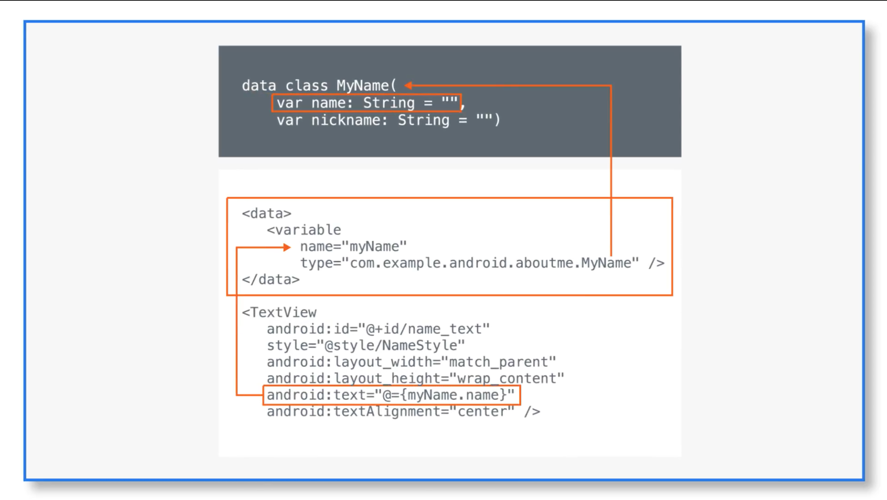
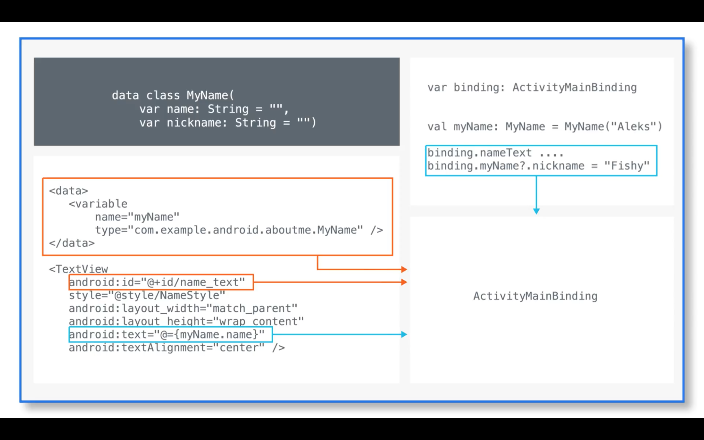

# Макеты

## Оглавление

- [Введение](#введение)
- [Редактор макетов](#редактор-макетов)
- [Добавление компонентов на макет с помощью редактора](#добавление-компонентов-на-макет-с-помощью-редактора)
  - [Добавление `TextView`](#добавление-textview)
  - [Создание стиля `TextView`](#создание-стиля-textview)
  - [Добавление `ScrollView`](#добавление-scrollview)
  - [Добавление `EditText`](#добавление-edittext)
  - [Добавление `Button`](#добавление-button)
- [Data Binding](#data-binding)
- [ConstraintLayout](#constraintlayout)
- [Ресурсы](#ресурсы)

## Введение

Документация на layouts: https://developer.android.com/guide/topics/ui/declaring-layout.

Макет определяет визуальную структуру пользовательского интерфейса, например, пользовательского интерфейса экрана или отдельного виджета. Существует два способа создания макета:
* Объявление элементов UI в XML. В Android имеется удобный способ описания XML-элементов для классов `View` и их подклассов.
* Программное создание экземпляров визуальных элементов путем наследования классов от `View` и его производных.

В Android все классы вызуальных элементов наследованы от `View`. От него унастледованы такие элементы как:
* `TextView` — компонент для отображения текста,
* `ImageView` — компонент для отображения изображения,
* `Button` — стандартная кнопка,
* `EditText` — компонент для ввода текста,
* и другие компоненты, такие как `CheckBox`, `Slider`, `Menu` и др.

Для размешения нескольних элементов на экране используются линейные макеты ([LinearLayout](https://developer.android.com/guide/topics/ui/layout/linear.html)).  
Разделяют горизонтальные и вертикальные макеты. Горизонтальные позволяют размещать эелементы в ряд по горизонтали. Вертикальные — в столбик по вертикали, соответственно.

Для изучения процесса создания макетов создадим простое приложение "About Me", отображающее информацию о целовека, а также позволяющее ввести какую-нибудь дополнительную информацию. В Android Studio для редактирования макетов используется специальный редактор диазайнов макетов, он будет далее рассмотрен. Кроме этого, будет рассмотрен способ передачи данных от элементов интерфейса к их программной реализации с помощью [Data Binding](#data-binding).

Для дальнейшего изучения необходимо создать новый проект "About Me". Шаги по созданию были описаны в конспекте №2.

## Редактор макетов

[Build a UI with Layout Editor](https://developer.android.com/studio/write/layout-editor.html)

В проекте созданном по-умолчанию уже присутствует один файл с макетом. Это `activity_main.xml`. Здесь содержится компонент `LinearLayout` с контентом внутри. Файл макета располагается в каталоге `res/layouts`, где располагаются все файлы макетов. Если кликнуть на файл дважды, откроется редактор макетов.

Редактор макетов предоставляет графический интерфес, упрощающий процесс построения макетов и размещения в них элементов интерфейса. Редактор содержит следующие панели:

1. **Palette** — список визуальных, элементов, которые можно добавить.
2. **Component Tree** — дерево уже добавленных макетов и компонентов в виде иерархии.
3. **Toolbar** — меню кнопок для настройки предварительного просмотра макета.
4. **Design editor** — основное окно редактора, отображающее макет с компонентами.
5. **Attributes** — панель с доступными свойствами и атрибутами текущего выбранного компонента с возможностью их редактирования.


Для добавления новых компонентов из **Palette** можно переносить их как на макет в **Design editor**, так и в определенное место иерархии на **Component Tree**.

Для переключения редактора к режиму редактирования XML-кода, необходимо выбрать вкладку **Text** внизу экрана редактора.

## Добавление компонентов на макет с помощью редактора

Приложение "About Me" будет оторажать имя и небольшое описание человека, а также возможность ввода и отображения никнейма.
План:
1. Добавить текстовые поля для отображения имени и описания.
2. Добавить возможность скроллинга страницы, если текст не убирается на экран полностью.
3. Добавить текстовое поле для ввода никнейма.
4. Добавить кнопку для приема введенного никнейма.

### Добавление `TextView`

Для добавления нового текстового поля необходимо в редакторе макетов взять элемент `TextView` из панели **Palette** и перенести на ихображение экрана в **Design Editor**.
На панели **Attributes** установить следующие параметры:
* `id` = **name_text** — идентификатор элемента.
* `layout_width` = **match_parent** — ширина элемента по ширине родителя, т.е. макета `LinearLayout`.
* `layout_height` = **wrap_content** — высота элемента по высоте контента, т.е. отображаемого текста.
* `text` = **Steve Jobs** — отображаемый текст.
* `textSize` = **20sp** — размер шрифта, указывается в **sp** (scale-independent pixels) независимых от масштабирования пикселях.
* `textColor` = **@android:color/black** — стандартный черный цвет.
* `textAlignment` = **center** — разместить контент (текст) по центру элемента `TextView`.

В Android принято хранить строки в отдельных ресурсах `strings`. Поэтому необходимо добавить текст с именем пользователя в отдельную строку:

```xml
<string name="name">Steve Jobs</string>
```

И указать в параметре `text` ссылку на добавленный ресурс **@strings/name**.

Размеры также принято хранить в ресурсах для возможности переиспользования. Файлов ресурсов с размерами имеет имя `res/dimens.xml`. Если его нет в проекте, его необходимо создать и добавить новое значение с размером шрифта текста:

```xml
<resources>
    <dimen name="text_size">20sp</dimen>
</resources>
```

И также указать ссылку на ресурс **@dimens/text_size** в параметр `textSize`.

### Создание стиля `TextView`

В ситуации, когда у нас есть множество однотипных текстовых полей или каких-либо других элементов интерфейса, удобным становится создание стилей элементов. Стиль — набор произвольных атрибутов, задающиеся разработчиком. Например, можно добавить для текстового поля шрифта (font family), отступы контента от края элемента (padding) и элемента от края макета (margin), а затем выделить атрибуты в отдельный стиль.

Сперва добавим к `TextView` следующие атрибуты:
* `fontFamily` = **sans-serif** — имя шрифта.
* `paddingTop` = **@dimen/small_padding** — отступ текста от края верхнего элемента `TextView`, ссылка на предварительно добавленный ресурс с размером (**small_padding=8dp**).
* `layout_marginTop` = **@dimen/layout_margin** — отступ `TextView` от верхнего края его родителя, т.е. элемента `LinearLayout`, ссылка на предварительно добавленный ресурс с размером **layout_margin=16dp**.

Существует два способа добавления стиля:
1. Добавить стиль вручную в файл `values/styles.xml`.
2. Использовать редактор макетов для автоматического создания стиля.

Для первого способа необходимо описать в файле `values/styles.xml` все атрибуты, которые необходимо объеденить в стиль:

```xml
<style name="NameStyle">
    <item name="android:layout_marginTop">@dimen/layout_margin</item>
    <item name="android:fontFamily">sans-serif</item>
    <item name="android:paddingTop">@dimen/small_padding</item>
    <item name="android:textColor">@android:color/black</item>
    <item name="android:textSize">@dimen/text_size</item>
</style>
```

К элементу `TextView` необходимо добавить атрибут **style="@style/NameStyle"** для применения стиля.

Для использования второго способа необходимо сперва перейти в редактор стилей. Затем нажать на элементе `TextView` на панели с добавленными элементами **Component Tree** правой кнопкой мыши, выбрать **Refactor** -> **Extract Style...**. Откроется диалоговое окно со списком атрибутов, необходимо проставить галочки у тех, которые необходимо выделить в отдельный стиль и указать его имя, например, "NameStyle". Таким образом стиль будет создан автоматически и добавлен в файл `values/styles.xml`, а атрибут **style** будет автоматически установлен в выбранный элемент `TextView`.

### Добавление `ScrollView`

Когда на экране настолько много контента, что он не умещается, необходимо располагать контент внутри `ScrollView` для возможности скроллинга.

В рамках приложения, добавим еще один `TextView`, который будет содержать достаточно длинное описание человека, чтобы оно не вмещалось на экране полностью.

```xml
<ScrollView
    android:layout_width="match_parent"
    android:layout_height="match_parent">

    <TextView
        android:id="@+id/bio_text"
        style="@style/NameStyle"
        android:layout_width="match_parent"
        android:layout_height="wrap_content"
        android:lineSpacingMultiplier="1.2"
        android:text="@string/bio" />
</ScrollView>
```

Для нового элемента `TextView` также указывается созданный стиль "NameStyle", создается строковый ресурс **@string/bio** с длинным текстом, а также добавляется новый параметр **lineSpacingMultiplier** — множитель интервала между строками в тексте.

Можно заметить, что добавленный текст располагается ровно от левого до правого края и это выглядит неаккуратно. Чтобы этого избежать Android Guidelines по дизайну предписывают добавление отступов от левого и правого края экрана. Для этого нужно добавить к корневому элементу атрибуты **paddingStart** и **paddingEnd**:

```xml
android:paddingStart="@dimen/padding"
android:paddingEnd="@dimen/padding"
```

Ресурс размера **@dimen/padding** берется равным **16dp** в данном примере.

### Добавление `EditText`

Перейдем к добавлению текстового поля для ввода никнейма.

Необходимо добавить элемент `EditText` на макет сразу после элемента `TextView` с именем (**id=name_text**). Можно сделать это вручную в XML, можно в редакторе макетов путем переноса элемента из панели **Palette** на панель **Component Tree**.

Для элемента `EditText` необхоидмо задать атрибуты:
* `id` = **nickname_edit_text**,
* `layout_width` = **match_parent**,
* `layout_height` = **wrap_content**,
* `style` = **@style/NameStyle** — ссылка на стиль "NameStyle",
* `textAlignment` = **center**,
* `hint` = **@string/what_is_your_nickname** — подсказка для ввода текста, отображается в поле полупрозрачным шрифтом, ссылка на строковый ресурс с строкой "What is your nickname?" (строку необходимо предварительно добавить).

Итоговый элемент должен быть следующим:

```xml
<EditText
    android:id="@+id/nickname_edit_text"
    style="@style/NameStyle"
    android:layout_width="match_parent"
    android:layout_height="wrap_content"
    android:hint="@string/what_is_your_nickname"
    android:textAlignment="center" />
```

### Добавление `Button`

Ввод никнейма не должен быть бесполезным. Логично было бы его принять и отобразить как текст. Для этого необходимо добавить еще одно текстовое поле `TextView` для отображения никнейма, а также кнопку `Button` для принятия введенного в `EditText` никнейма и отображения его на новом `TextView`.

Спева добавим кнопку для принятия введенного никнейма. Кнопку требуется расположить следом за текстовым полем `EditText`. Кнопке присваиваются следующие атрибуты:
* `id` = **done_button**,
* `layout_width` = **wrap_content**,
* `layout_height` = **wrap_content**,
* `layout_gravity` = **center_horizontal** — расопложить кнопку в центре по горизонтали относительно макета,
* `fontFamily` = **sans-serif**,
* `text` = **@string/done** — ссылка на строковый ресурс с текстом "Done",
* `style` = **@style/Widget.AppCompat.Button.Colored** — ссылка на стандартный стиль, позволяющий делать кнопку цветной.

Итоговый элемент:

```xml
<Button
    android:id="@+id/done_button"
    style="@style/Widget.AppCompat.Button.Colored"
    android:layout_width="wrap_content"
    android:layout_height="wrap_content"
    android:layout_gravity="center_horizontal"
    android:layout_marginTop="@dimen/layout_margin"
    android:fontFamily="sans-serif"
    android:text="@string/done" />
```

Для отображения введенного никнейма потребуется еще один элемент `TextView`. Добавить его необходимо после кнопки "Done". Новый `TextView` имеет абсолютно идентичные атрибуты, что и текстовое поле с `id` **name_text**.  
Отличия: `id`=**nickname_text** и `visibility`=**gone** (скрыть текстовое поле по умолчанию).

Далее необхоидмо добавить обработчик события нажатия на кнопку "Done", который будет текст из `EditText` помещать в текстовое поле **nickname_text** и скрывать ненужный `EditText`.

**Добавление обработчкика нажатия на кнопку:** 

```java
// внутри MainActivity::onCreate
findViewById<Button>(R.id.done_button).setOnClickListener {
    addNickname(it)
}

// приватный метод класса MainActivity
private fun addNickname(view: View) {
    val nicknameEditText = findViewById<EditText>(R.id.nickname_edit_text)
    val nicknameTextView = findViewById<TextView>(R.id.nickname_text)

    nicknameTextView.text = nicknameEditText.text
    nicknameEditText.visibility = View.GONE // скрывает поле для ввода никнейма
    view.visibility = View.GONE // скрываем кнопку "Done"
    nicknameTextView.view = View.VISIBLE // отображаем поле с введенным никнеймом

    // Скрыть клавиатуру после нажатия на кнопку
    val imm = getSystemService(Context.INPUT_METHOD_SERVICE) as InputMethodManager
    imm.hideSoftInputFromWindow(view.windowToken, 0)
}
```

## Data Binding

Можно заметить, что для получения каждого визуального элемента на макете необходим вызов `findViewById()`, и когда элементов становится очень много, а это неминуемо при разработке большого приложения, код становится многословным и однообразным.

Data Binding поможет организовать работу с `View` так, чтобы не пришлось писать множество методов `findViewById()`. По сути Data Binding — это еще один способ доступа к View-элементам наряду с вызовом `findViewById()`.

Сперва необходимо включить возможность использования Data Binding. Добавляем в Gradle-файл модуля `app` в блок `android`:

```gradle
dataBinding {
	enabled = true
}
```

Затем, необходимо добавить тэг `<layout></layout>` в файл `activity_main.xml` и поместить внутрь него имеющийся макет `LinearLayour` :

```xml
<layout xmlns:android="http://schemas.android.com/apk/res/android"
    xmlns:app="http://schemas.android.com/apk/res-auto">

    <!-- LinearLayout code -->
</layout>
```

Далее переключаемся в `MainActivity` и создаем поле `binding`, которое будет объектом доступа к элементам макета `activity_main`.

```java
private lateinit var binding: ActivityMainBinding
```

Класс `ActivityMainBinding` сгенерирован автоматически. Имя класса берется из имени layout-файла (т.е. `activity_main`) с добавлением слова "Binding". `ActivityMainBinding` знает все о содержимом макета: какие View-элементы там есть, каких они типов, и как можно с ними взаимодействовать.

Ключевое слово `lateinit` помечает поле класса как "будет проинициализировано позже". По-умолчанию Kotlin требует инициализировать поля либо при их объявлении, либо в конструкторе класса. В данном же случае поле `binding` будет проинициализированно в методе `onCreate()`. Именно в этом методе в Andorid принято инициализировать поля (либо при их объявлении). Поэтому здесь ключевое слово `lateinit` необходимо. В противном случае компилятор выдаст ошибку.

Для возможности использования Data Binding на уровне класса `MainActivity` необходимо проинициализировать поле `binding` и указать для него макет, данные из которого необходимо использовать:

```java
binding = DataBindingUtil.setContentView(this, R.layout.activity_main)
```

Описанную выше строку необходимо добавить вместо вызова `setContentView(R.layout.activity_main)`. Метод `DataBindingUtil.setContentView()` внутри себя выполнит вызов стандартного `setContentView()` для активности, а также настроит и вернет объект `ActivityMainBinding`.

Теперь можно заменить вызов `findViewById<Button>(R.id.done_button)` для получения экземпляра кнопки на `binding.doneButton`:

```java
binding.doneButton.setOnClickListener {
    addNickname(it)
}
```

По сути объект Data Binding предоставляет доступ к объектам интерфейса непосредственно по их идентификаторам.  
Также можно обновить код метода `addNickname()` с использованием поля `binding`:

```java
private fun addNickname(view: View) {
    binding.apply {
        nicknameTextView.text = nicknameEditText.text
        invalidateAll()
        nicknameEditText.visibility = View.GONE
        doneButton.visibility = View.GONE
        nicknameText.visibility = View.VISIBLE
    }
    val imm = getSystemService(Context.INPUT_METHOD_SERVICE) as InputMethodManager
    imm.hideSoftInputFromWindow(view.windowToken, 0)
}
```

Вызов метода `apply` позволяет описать целый блок кода, внутри которого можно не писать каждый раз обращение к полю `binding`.  
Вызов метода `binding.invalidateAll()` выполняет обновление вида элементов интерфейса на макете в соответствии с измененными данными. Его рекомендуется вызывать после изменения каких-либо данных на макете.

**Схема объяления и использования переменной Data Binding в рамках XML-кода:**


Кроме доступа к элементам интерфейса внутри классов есть возможность получить доступ к данным на уровне XML-кода. Допустим, приложение хранит данные в отдельном классе `UserName`:

```java
data class UserName (
    var name: String = "",
    var nickname: String = "")
```

Для того, чтобы обратиться к полям конкретного экземпляра данного класса необходимо выполнить следующие шаги.

**1. Добавить тэг `<data>` с описанием переменной класса в XML-файл макета:**

```xml
<data>
    <variable
        name="myName"
        type="com.example.aboutme.UserName" />
</data>
```

Данный код объявляет переменную `userName` типа `UserName` на уровне макета. Имя класса пишется полностью вместе с именем пакета.

**2. Заменить использование ссылки на ресурс @string/name на ссылку на переменную `userName`:**

```xml
android:text="@={userName.name}"
```

Теперь компонент `TextView`, отображающий имя из строкового ресурса, будет отображать значение поля `name` объекта `userName`.

Аналогично нужно сделать и для текстового поля с никнеймом.

**3. Создать данные для отображения на макете с помощью Data Binding:**

Для того, чтобы переменная `userName` имела какие-нибудь данные, необходимо, во первых, создать экземпляр класса `UserName`.

```java
// Поле класса MainActivity
private val userNameFromActivity: UserName = UserName("Steve Jobs")
```

Во вторых, необходимо проинициализировать поле `userName`, получаемое с помощью Data Binding по его имени.

```java
binding.userName = userNameFromActivity
```

Таким образом данные, содержащиеся в объекте `userNameFromActivity` (`name`="Steve Jobs") будут использоваться на уровне XML-кода через переменную `userName`. 

Для редактирования никнейма можно также использовать возможность доступа к переменной `userName`:

```java
// nicknameTextView.text = nicknameEditText.text
userName?.nickname = nicknameEditText.text.toString()
```

**Схема инициализации и использования переменной Data Binding в рамках Kotlin-кода:**


## ConstraintLayout

## Ресурсы
