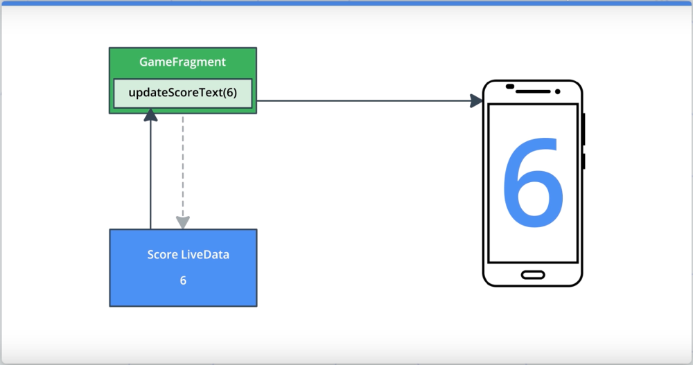

# Архитектура приложения (UI)

## Оглавление

- [Введение](#введение)
- [Шаблон Model-View-ViewModel](#шаблон-model-view-viewmodel)
- [ViewModel](#viewmodel)
- [LiveData](#livedata)
  - [Добавление `LiveData`](#добавление-livedata)
  - [Инкапсуляция `LiveData`-полей](#инкапсуляция-livedata-полей)
  - [Добавление события завершения игры](#добавление-события-завершения-игры)
- [Добавление таймера](#добавление-таймера)
- [ViewModel Factory](#viewmodel-factory)

## Введение

Архитектура — одна из важнейших вещей при разработке программного продукта, будь то полноценное приложение для ПК, веб-приложенеи, мобильное приложение или что-то еще.  Архитектура в данном случае подразумевает то, что приложение разделено на несколько модулей, каждый из которых отвечает за что-то одно конкретное. Например, модуль с пользовательским интерфейсом приложения отвечает только за отображение элементов и данных на экране, модуль базы данных отвечает только за хранение данных в приложении, модуль уведомлений отвечает только за отправку уведомлений в конкретное время с конкретным сообщением и т.д.

Для каждой платформы существуют уже готовые шаблоны проектирования архитектуры, например шаблон "Модель-Вид-Контроллер", выделяющий три основные сущности: модель, содержащую данные; вид, отображающий данные; и контроллер, необходимый для взаимодействия между видом и данными (например, для выполнения каких-либо операций с данными).

Этот урок будет посвящен разработке архитектуры Adnroid-приложения по шаблону MVVM — Model-View-ViewModel. Подробнее о шаблоне будет далее.

В качестве примера используется приложение "Guess It", которое представляет собой игру для угадывания слов. Игрок берет в руки устройство, запускает приложение и оно отображает на экране слово, а второй игрок должен его угадать не глядя. Приложение дает некоторое время для угадывания, когда время заканчивается, игроку показывается количество очков (отгаданных слов). Также приложение позволяет пропустить слово и отметить, что оно отгадано.

Начальный код приложения не имеет полноценного функционала для игры, он не содержит таймера, который должен отсчитывать время, а страница с очками игрока отображается, когда игрок прошел по всем словам, что есть в приложении.

Проект приложения "Guess It" содержит следующее:

* Пустую активность `MainActivity`.
* Три фрагмента: `TitleFragment`, `GameFragment` и `ScoreFragment`.
* Граф навигации `main_navigation.xml`, содержащий навигацию `TitleFragment` -> `GameFragment` -> `ScoreFragment` -> `GameFragment`.

`TitleFragment` — начальный фрагмент приложения. Содержит лишь одну кнопку "Play", выполняющую переход к `GameFragment`.

`GameFragment` — основной фрагмент всей игры. Этот фрагмент содержит всю логику игры и содержит следующее:
* `word` — свойство, содержащее текущее отображаемое на экране слово.
* `score` — свойство, содержащее текущее количество очков.
* `wordList` — mutable-список (изменяемый) всех слов доступных для игры. Список инициализируется в методе `resetList()` и там же перемешивается, поэтому и является изменяемым.
* `resetList()` — метод для инициализации и перемешивания списка слов `wordList`.
* `onSkip()` и `onCorrect()` – методы обработчики нажатия на кнопки "Skip" и "Got It", соответственно.
* `nextWord()` — метод, выдающий следующее слово для угадывания. Если в списке `wordList` еще есть слова, то метод достает из списка следующее слово, сохраняет его в свойство `word` и удаляет слово из списка. Если же список `wordList` пуст, то вызывается метод `gameFinished()`.
* `gameFinished()` — метод, вызывающийся по окончанию игры, выполняет переход к `ScoreFragment` и передает в фрагмент количество набранных очков.

`ScoreFragment` — фрагмент, отображающий результат игры — количество набранных очков и кнопку для "Play Again" для повторного запуска игры.

Основная проблема с начальным кодом приложения в том, что при смене ориентации экрана данные (текущее слово, список слов и количество очков) сбрасываются. Эту проблему можно было бы решить с помощью `onSaveInstanceState()`, однако такое решение использовать не принято. В методах для сохранения и восстановления состояния потребуется писать много кода, также хранение данных в `Bundle` не удобно, количество типов и классов, объекты которых можно сохранять, также ограничено. 

Для решения проблемы сохранения состояния приложения используется библиотека Lifecycle Library, содержащая такие классы как `ViewModel`, `LiveData`, помогающие в работе с состоянием приложения и организовать удобную архитектуру приложения по шаблону MVVM.

## Шаблон Model-View-ViewModel

MVVM (Model-View-ViewModel) — это шаблон построения архитектуры Android-приложений.

**View** — это абстракция для `Activity`, `Fragment`а или любой другой собственной `View`. Не путать с классом `View`. Задача **View** — исключительно отображение данных. **View** не должна содержать в себе какой-либо логики по преобразованию данных, которые она должна отображать. Содержать данные View также не должна. Она должна хранить ссылку на экземпляр **ViewModel** и все данные, которые нужны **View**, должны поступать из **ViewModel**. Задача **View** — следить за данными и менять свой вид, когда данные из **ViewModel** меняются. Если кратко, то **View** отвечает за отображение и отслеживание изменений данных для layout'ов.

**ViewModel** — это компонент, содержащий данные и логику, когда данные должны быть получены и когда отображены на **View**. **ViewModel** хранит текущее состояние данных. Также **ViewModel** хранит ссылки на один или несколько экземпляров **Model**'ей, от которых получает данные. **ViewModel** не располагает информацией, откуда данные получены, будь то база данные или внешний сервер. Также **ViewModel** не должна ничего знать о **View**. **ViewModel** лишь является посредником между данными и видом.

**Model** — это абстракция для слоя, который подготавливает данные для **ViewModel**. **Model** — это класс, который получает данные из каких-либо источников (например, базы данных или сервера). Стоит отметить, что это не тот же класс, что, например, `User` или `Car`, которые обычно просто хранят какие-либо данные. **Model**-классы сложнее, они и получают данные, и подготавливают их для передачи в **ViewModel**. Соответственно **Model** не должна ничего знать о **ViewModel** и **View**.

Если шаблон MVVM реализуется в проекте правильно, это делает код более структурированным, удобным в тестировании и поддержке.

Если рассматривать приложение "Guess It", то, например, фрагмент `GameFragment` будет являться **View** в шаблоне MVVM, для этого **View** необходимо будет создать **ViewModel** и назвать класс `GameViewModel`. `GameViewModel` будет хранить очки игры, список слов и текущее отображаемое слово, а также логику по выбору текущего слово и подсчета очков.


## ViewModel

`ViewModel` — абстрактный класс, который служит для хранения данных интерфейса приложения и "переживает" изменения конфигурации системы. Так при смене ориентации экрана данные не будут потеряны, что избавляет от необходимости описания метода `onSaveInstanceState()`. 

Далее перейдем к реализации собственного `ViewModel`-класса.

**1. Добавление зависимости от библиотеки Lifecycle Library:**

Сперва необходимо добавить зависимость от `lifecycle-extensions`, модуля библиотеки Lifecycle Library, содержащего класс `ViewModel`.

```gradle
implementation 'androidx.lifecycle:lifecycle-extensions:2.2.0'
```

**2. Создание класса `GameViewModel`:**

Далее необходимо создать класс `GameViewModel` и унаследовать его от `ViewModel`. Добавить в класс блок `init` и переопределение метода `onCleared()`. Первый будет вызван при создании класса, второй — при уничтожении. Добавить в методы логирование.

```kotlin
class GameViewModel : ViewModel() {

    init {
        Log.i("GameViewModel", "GameViewModel created")
    }

    override fun onCleared() {
        super.onCleared()
        Log.i("GameViewModel", "GameViewModel destroyed")
    }
}
```

**3. Добавить инициализацию `GameViewModel` в `GameFragment`:**

Далее необходимо добавить экземпляр `GameViewModel` в класс `GameFragment`, чтобы **View** могло получать информацию и взаимодействовать с **ViewModel**. 

```kotlin

class GameFragment : Fragment() {

    private lateinit var viewModel: GameViewModel

    ...

    override fun onCreateView(inflater: LayoutInflater, container: ViewGroup?,
                              savedInstanceState: Bundle?): View? {
        ...
        Log.i("GameFragment", "Called ViewModelProvider.get")
        viewModel = ViewModelProvider(this).get(GameViewModel::class.java)

        resetList()
        nextWord()
        ...
    }
}
```

Экземпляр `viewModel` инициализируется с помощью вызова `ViewModelProvider.get()`. Вызов `ViewModelProvider.get()` создает новый экземпляр `viewModel` типа `GameViewModel`. В конструктор класса `ViewModelProvider` передается экземпляр текущего фрагмента, что позволяет в дальнейшем объекту `viewModel` отслеживать состояние жизненного цикла фрагмента.  
Первый раз вызов `ViewModelProvider.get()` выполняется при открытии экрана `GameFragment` и вызове метода `onCreateView()`. При смене ориентации экрана при повторном вызове `onCreateView()` вызов `ViewModelProvider.get()` вернет уже существующий экземпляр, вместо создания нового.

Если запустить приложение и перейти к экрану "Game", в лог будут выведены сообщения о вызове `ViewModelProvider.get()` и создании экземпляра `GameViewModel`. При смене ориентации в лог будет выведен уже только сообщение о `ViewModelProvider.get()`, но не сообщение о создании нового экземпляра `ViewModel`-класса, поскольку новый экземпляр не создается, а возвращается существующий. Это происходит, потому что экземпляр `ViewModel`-класса хранит свое состояние на протяжении всей жизни фрагмента. Если же выйти с экрана `GameFragment`, то будет вызван метод `onCleared()` класса `GameViewModel` и выведено сообщение об уничтожении экземпляра класса.

```
2020-02-17 23:38:26.575 com.example.android.guesstheword I/GameFragment: Called ViewModelProvider.get
2020-02-17 23:38:26.577 com.example.android.guesstheword I/GameViewModel: GameViewModel created
2020-02-17 23:38:38.526 com.example.android.guesstheword I/GameFragment: Called ViewModelProvider.get
2020-02-17 23:38:45.945 com.example.android.guesstheword I/GameFragment: Called ViewModelProvider.get
2020-02-18 00:05:57.594 com.example.android.guesstheword I/GameViewModel: GameViewModel destroyed
```

Класс `GameViewModel` должен содержать данные игры, в данном случае это текущее слово для игры, количество игровых очков и общий список слов для игр, т.е. поля `word`, `score` и `wordList`, соответственно. Таким образом поля необходимо из класса `GameFragment` перенести в класс `GameViewModel`. 

Далее необходимо в класс `GameViewModel` перенести методы, которые работают с перенесенными полями, а это `resetList()`, `nextWord()`, `onSkip()`, и `onCorrect()`.

Далее стоит заметить, что вызовы методов `resetList()` и `nextWord()` используются в методе `onCreateView()` при инициализации класса `GameFragment`. Поскольку эти методы перенесены в `GameViewModel`, то их вызов есть смысл поместить в блок `init` класса `GameViewModel`, который как раз будет вызван в рамках `GameViewModel.onCreateView()`.

Далее необходимо обновить код обработчиков нажатия на кнопки `onClickListener()` кнопок "Correct" и "Skip". Необходимо использовать объект `viewModel` для вызова `onCorrect()` и `onSkip()`, а также перенести вызовы `updateWordText()` и `updateScoreText()`, поскольку в классе `GameViewModel` их нет. А нет из там потому, что они выполняют обновление вида в связи с обновленными данными и на уровне `ViewModel`-класса не должны находиться.

```kotlin
override fun onCreateView(inflater: LayoutInflater, container: ViewGroup?,
                              savedInstanceState: Bundle?): View? {
    ...

    binding.correctButton.setOnClickListener {
        viewModel.onCorrect()
        updateWordText()
        updateScoreText()
    }
    binding.skipButton.setOnClickListener {
        viewModel.onSkip()
        updateWordText()
        updateScoreText()
    }
    ...
}
```

Далее необходимо обновить методы в `GameFragment`, где используются поля `word` и `score`. Сделать поля НЕ приватными и использовать доступ к ним через объект `viewModel` в методах класса `GameFragment`.

В итоге необходимо подчистить код класса `GameViewModel`. Так, например, в классе используется метод `gameFinished()` определенный во фрагменте. Однако, `ViewModel`-класс не должен содержать ссылок на фрагмент, поэтому на данный момент вызов этого метода необходимо закомментировать.

Если на текущем этапе запустить приложение можно заметить, что игра идет, однако, не заканчивается несмотря на то, что общее число слов для игры заканчивается. Однако, если проверить смену ориентации устройства, то можно убедиться, что проблем со сбросом данных нет.

**Преимущества:**

* Код более структурированный, организованный, им проще управлять.
* Легче отлаживать.
* Нет необходимости следить за состоянием **ViewModel**. Состояние не теряется.
* **ViewModel** не содержит зависимостей от фрагментов и активностей, что упрощает unit-тестирование.

## LiveData

`LiveData` — это класс для хранения данных, который работает по принципу шаблона Observer (наблюдатель), т.е, этот класс позволяет отслеживать изменение данных. `LiveData` позволяет следующее:

1. Помещать какой-либо объект в хранилище.
2. Подписаться на обновления объекта и получать его обратно.

Обычно подписчиками `LiveData` являются активности и фрагменты. В применении к приложению, подписчиком будет `GameFragment`. Он будет подписываться на изменения очков (поля `score`) в `LiveData` и когда это значение будет изменяться, автоматически будет вызываться метод `updateScoreText()` для обновления значения на экране. При этом тип поля `score` нужно будет заменить с `Int` на шаблонный класс `MutableLiveData<Int>`.



Далее перейдем к преобразованию кода.

## Добавление `LiveData`

**1. Использование `MutableLivaData` как тип для `word` и `score`:**

Значение по умолчанию можно передавать в конструктор.

```kotlin
var word = MutableLiveData<String>("")
var score = MutableLiveData<Int>(0)
```

**2. Изменить использование `word` и `score` на `word.value` и `score.value`:**

```kotlin
// GameViewModel

fun onSkip() {
    score.value = score.value?.minus(1)
    nextWord()
}

fun onCorrect() {
    score.value = score.value?.plus(1)
    nextWord()
}
```

```kotlin
// GameFragment

private fun gameFinished() {
    val action = GameFragmentDirections.actionGameToScore(viewModel.score.value ?: 0)
    findNavController(this).navigate(action)
}
private fun updateWordText() {
    binding.wordText.text = viewModel.word.value
}

private fun updateScoreText() {
    binding.scoreText.text = viewModel.score.value.toString()
}
```

**3. Настроить подписку на изменение значений `word` и `score`:**

```kotlin
viewModel.word.observe(viewLifecycleOwner, Observer { newWord ->
    binding.wordText.text = newWord
})
viewModel.score.observe(viewLifecycleOwner, Observer {newScore ->
    binding.scoreText.text = newScore.toString()
})
```

Код выше описывает механизм подписки на изменение значений `LiveData` с помощью метода `observe()`.  
Первым параметром передается экземпляр объекта, отвечающего за жизненный цикл. Для фрагментов это стандартное свойство `viewLifecycleOwner`, для активности — это будет сам экземпляр активности.  
Вторым параметром указывается объект `Observer`, описывающий код, который должен выполнится, когда значение изменилось. Блок — это описание теkа метода-обработчика `onChanged()` интерфейса `Observer`. В данном случае при изменении текущего слова, выполняется установка нового слова в текстовое поле `TextView`, а в случае изменения числа очков то же самое выполнится для второго текстового поля.

После этого изменения можно удалить все упоминания о методах `updateWordText()` и `updateScoreText()` и приложение должно работать, как и раньше.

Несколько слов о работе `LiveData` в рамках жизненного цикла:

* `LiveData` знает о существовании жизненного цикла.
* Когда **View** не отображается/свернуто/скрыто, `LiveData` обновляет данные внутри себя, но не посылает обновления на **View**.
* Когда **View** становится снова видимым, `LiveData` автоматически посылает текущие хранимые данные.
* Когда **View** уничтожается, `LiveData` автоматически очищает соединение. Вручную этого делать не нужно.

### Инкапсуляция `LiveData`-полей

Сейчас поля `word` и `score` не имеют спецификаторов `private`, а значит по-умолчанию на уровне одного пакета они могут использоваться в любых других классах и файлах. Однако, необходимости изменять эти значения вне класса `GameViewModel` нет. Кроме того по шаблону MVVM **View** не должно иметь никакой информации о данных, кроме значений. Иметь возможности менять данные напрямую также быть не должно. Поэтому необходимо инкапсулировать поля, чтобы внешние классы не имели возможности редактирования их значений.

**1. Создание приватных полей `_word` и `_score`:**

```kotlin
private var _word = MutableLiveData<String>("")
private var _score = MutableLiveData<Int>(0)
```

**2. Переопределение полей `word` и `score`:**

Класс `MutableLiveData`, как видно из названия, создает объект `LiveData`, который можно изменять. Класс `LiveData` предоставляет в свою очередь неизменяемые объекты. Это и необходимо в данном случае, чтобы данные мог менять только сам класс `GameViewModel`, а наружу будет предоставляться неизменяемое поле, лишь предоставляющее данные. 

```kotlin
val word: LiveData<String>
    get() = _word

val score: LiveData<Int>
    get() = _score
```

**3. Заменить использование полей `word` и `score` на `_word` и `_score` внутри `GameViewModel`:**

```kotlin
private fun nextWord() {
    //Select and remove a word from the list
    if (wordList.isEmpty()) {
//      gameFinished()
    } else {
        _word.value = wordList.removeAt(0)
    }
}

fun onSkip() {
    _score.value = score.value?.minus(1)
    nextWord()
}
fun onCorrect() {
    _score.value = score.value?.plus(1)
    nextWord()
}
```

Теперь при попытке изменить данные полей `word` и  `score` на уровне класса `GameFragment` среда подсветит код красным цветом, а компилятор не позволит проекту собраться.

## Добавление события завершения игры

Для завершения игры необходимо вызвать метод `gameFinished()`, когда кончаются все слова в списке `wordList`. Сейчас вызов метода `gameFinished()` вызывается в классе `GameViewModel`, а описание метода находится в `GameFragment`. Поскольку **ViewModel** не должен ничего знать о **View**, необходимо передать информацию о завершении игры от `GameViewModel` фрагменту. 

Сначала вместо открытия экрана окончания игры в методе `gameFinished()` опишем показ обычного `Toast`-сообщения. Оно будет использоваться для тестирования.

```kotlin
private fun gameFinished() {
//        val action = GameFragmentDirections.actionGameToScore(viewModel.score.value ?: 0)
//        findNavController(this).navigate(action)
    Toast.makeText(activity, "Game Finished", Toast.LENGTH_SHORT).show()
}
```

Далее добавление возможности оповещения фрагмента о событии окончания игры.

**1. Добавление булева свойства `eventGameFinish` в класс `GameViewModel`:**

```kotlin
private var _eventGameFinish = MutableLiveData<Boolean>(false)
val eventGameFinish: LiveData<Boolean>
    get() = _eventGameFinish
```

**2. Установка значения `_eventGameFinished`, когда список слов пуст:**

```kotlin
private fun nextWord() {
    //Select and remove a word from the list
    if (wordList.isEmpty()) {
        resetList()
        _eventGameFinish.value = true
    }
    _word.value = wordList.removeAt(0)
}
```

Кроме установки значения `_eventGameFinished` здесь же добавляется вызов `resetList()` для инициализации и перемешивания списка слов, чтоб игру заново можно было корректно начать.

**3. Подписка фрагмента на изменение `eventGameFinished`:**

```kotlin
viewModel.eventGameFinish.observe(viewLifecycleOwner, Observer {finished ->
    if (finished)
        gameFinished()
})
```

В обработчике проверяется значение свойства `eventGameFinish` и если значение `true` (игра окончена), то вызывается метод `gameFinished()`.

Если запустить приложение и пройтись по всем словам, то в конце приложение отобразит `Toast`-сообщение из метода `gameFinished()`. Однако, сейчас есть одна проблема — если сменить ориентацию устройства, то сообщение будет показано снова. Это связано с тем, что после пересоздания фрагмента, `LiveData` посылает сохраненные заранее данные, а сохранено именно значение `true` в свойстве `eventGameFinish`. Чтобы исправить такой баг, необходимо после срабатывания события окончания игры сбрасывать значение свойства в значение по-умолчанию.

**4. Добавление метода `onGameFinishComplete()` для сброса `eventGameFinish`:**

```kotlin
// GameViewModel

fun onGameFinishComplete() {
    _eventGameFinish.value = false
}
```

```kotlin
// GameFragment

viewModel.eventGameFinish.observe(viewLifecycleOwner, Observer {finished ->
    if (finished) {
        gameFinished()
        viewModel.onGameFinishComplete()
    }
})
```

Теперь после окончания игры, мы сбрасываем значение `eventGameFinish` в `false` и `Toast`-сообщение не будет показано после смены ориентации экрана.

И в конце можно убрать тестовое `Toast`-сообщение и раскомментировать код перехода к экрану окончания игры.  
После запуска можно убедиться, что игра работает корректно: очки считаются, текущее слово меняется, слова в списке заканчиваются и после их окончания будет показан экран с итоговым счетом и возможностью начать игру заново.

## Добавление таймера

Для полноты функционала игре не хватает таймера, который будет отсчитывать время до окончания игры. По окончанию игры будет показно окно с сообщением о завершении игры и количеством заработанных очков.

Вопрос: где логично было бы разместить таймер: в `GameFragment` или `GameViewModel`?

Ответ: В `GameViewModel`. Поскольку время работы таймера — должно сохраняться при смене ориентации устройства.

В данном примере таймером будет служить экземпляр абстрактного класса `CountDownTimer`.

```kotlin
CountDownTimer(/* Full time */, /* Tick time */) {

    override fun onTick(millisUntilFinished: Long) {
        // TODO implement what should happen each tick of the timer
    }

    override fun onFinish() {
        // TODO implement what should happen when the timer finishes
    }
}
```

Класс `CountDownTimer` имеет два абстрактных метода. Метод `onTick()` выполняется на каждый "тик" таймера. Метод `onFinish()` выполняется по завершении работы таймера.

**1. Добавление таймера в `GameViewModel`:**

Перед добавлением таймера необходимо добавить статические поля `ONE_SECOND` и `GAME_TIME`, которые будут содержать время в миллисекундах одной секунды и времени всей игры, которая для тестов взята в размере 10 секунд.

```kotlin
companion object {
    // This is the number of milliseconds in a second
    const val ONE_SECOND = 1000L
    // This is the total time of the game
    const val GAME_TIME = 10 * ONE_SECOND
}

private var timer: CountDownTimer

init {
    ...
    timer = object : CountDownTimer(GAME_TIME, ONE_SECOND) {
        override fun onTick(millisUntilFinished: Long) {
            // TODO
        }
        override fun onFinish() {
            _eventGameFinish.value = true
        }
    }
    timer.start()
}
```

В блоке `init` создается объект абстрактного класса и описывается реализация его абстрактных методов. В конструктор `CountDownTimer` передается общее время работы таймера и время интервала между тиками. В методе `onFinish()` можно сразу описать, что должно выполниться по окончанию работы таймера, а именно установка "флага" о том, что игра завершена. Таймер запускается при инициализации `GameViewModel`, т.е. при открытии окна с игрой.

**2. Отображение оставшегося времени:**

Далее необходимо, чтобы на каждый тик таймера на экране игры отображалось новое время, оставшееся до конца игры.  
Время до конца игры будет храниться также в классе `GameViewModel` в `MutableLiveData`.

```kotlin
private var _secondsUntilEnd = MutableLiveData<Long>()
val secondsUntilEnd: LiveData<Long>
    get() = _secondsUntilEnd
```

Время до конца игры будет хранится в секундах. Именно количество секунд будет отображаться на экране.

В блоке `init` необходимо проинициализировать `_secondsUntilEnd` временем на игру в секундах.

```kotlin
_secondsUntilEnd.value = GAME_TIME / ONE_SECOND
```

Далее необходимо обновлять значение `_secondsUntilEnd` на каждый тик таймера. Метод `onTick()` принимает в качестве параметра количество миллисекунд оставшихся до окончания работы таймера. В поле `_secondsUntilEnd` необходимо записать именно это значение, но в секундах.

```kotlin
override fun onTick(millisUntilFinished: Long) {
    _secondsUntilEnd.value = millisUntilFinished / ONE_SECOND
}
```

И в конце необходимо настроить подписку на изменение значения оставшегося времени в классе `GameFragment`.

```kotlin
// GameFragment.onCreate()

viewModel.secondsUntilEnd.observe(viewLifecycleOwner, Observer {secondsUntilEnd ->
    binding.timerText.text = DateUtils.formatElapsedTime(secondsUntilEnd)
})
```

В обработчике выполняется преобразование количества секунд к строке вызовом `DateUtils.formatElapsedTime()`. Данный метод принимает на вход количество секунд, а на выходе получается строка с привычным представлением времени, например, "00:10". Полученная строка записывается в текстовое поле для отображения времени `timerText`.

После всех выполненых операций можно запустить приложение и убедиться, что игра ведется на время, а по истечении времени пользователю показывается экран с сообщением о завершении игры и количеством набранных очков.

## ViewModel Factory

Можно заметить, что созданный ранее класс `GameViewModel` имеет только конструктор по-умолчанию, а все его `LiveData`-поля инициализируются лишь некоторыми значениями по-умолчанию. Инициализация объекта этого класса выполняется следующим образом:

```kotlin
viewModel = ViewModelProvider(this).get(GameViewModel::class.java)
```

То есть код инициализации не предполагает вызов конструктора напрямую и передачу ему каких-либо параметров. Как тогда быть, когда мы хотим инициализировать некоторые поля `ViewModel`-класса самостоятельно путем передачи аргументов в конструктор.

Например, если рассмотреть класс `ScoreFragment`, отображающий финальное число набранных в игре очков `score`, можно заметить, что значение текстового поля с очками `scoreText` устанавливается из переданных во фрагмент данных из `Bundle`.

```kotlin
val scoreFragmentArgs by navArgs<ScoreFragmentArgs>()
binding.scoreText.text = scoreFragmentArgs.score.toString()
```

Следуя принципам шаблона MVVM, необходимо хранить количество очков `score` внутри `ViewModel` класса. Однако, в этом случае значение `score` необходимо передавать внутрь `ViewModel`-класса, а значит для класса `ScoreViewModel` необходим конструктор с параметром.

Для создания конструкторов с параметром используют фабрики классов **ViewModel Factory**.  
ViewModel Factory — это класс, который знает о том, как создавать классы `ViewModel`.

Шаги по добавлению конструктора для `ViewModel`-класса:

1. Создать `ViewModel`-класс, принимающий параметр в конструкторе.
2. Создать `ViewModelFactory`-класс для создания экземпляра `ViewModel`.
3. Использовать `ViewModelFactory`-класс для получения экземпляра `ViewModel` с помощью `ViewModelProvider` в коде фрагмента.

**1. Добавление класса `ScoreViewModel`:**

Сперва создадим класс `ScoreViewModel` для класса `ScoreFragment`.  
Класс будет иметь параметр конструктора `finalScore` и `LiveData`-поле `score`, которое будет проинициализировано параметром в блоке `init`.

```kotlin
class ScoreViewModel(finalScore: Int) : ViewModel() {

    private val _score = MutableLiveData<Int>()
    val score: LiveData<Int>
        get() = _score

    init {
        _score.value = finalScore
    }
}
```

**2. Добавление класса `ScoreViewModelFactory`:**

Далее добавляется класс `ScoreViewModelFactory`, который будет создавать экземпляр `ScoreViewModel`, передавая ему параметр в конструктор. Данный класс также имеет конструктор с параметром, а также переопределение шаблонного метода `create()`.  
Параметр `modelClass` — это класс, объект которого запрашивается для создания. В нашем случае это `ScoreViewModel`. В блоке `if` выполняется проверка на то, что объект `modelClass` является именно типом `ScoreViewModel` или может быть к нему приведен. И если условие выполняется, то метод создает экземпляр `ScoreViewModel`, вызывая конструктор с параметром, и возвращает значение.

```kotlin
class ScoreViewModelFactory(private val finalScore: Int) : ViewModelProvider.Factory {

    override fun <T : ViewModel?> create(modelClass: Class<T>): T {
        if (modelClass.isAssignableFrom(ScoreViewModel::class.java)) {
            return ScoreViewModel(finalScore) as T
        }
        throw IllegalArgumentException("Unknown ViewModel class")
    }
}
```

**3. Использование `ScoreViewModelFactory` для создания `ScoreViewModel` в коде `ScoreFragment`:**

Далее для использования фабрики для создания `ScoreViewModel` необходимо сперва добавить соответствующие свойства в класс.

```kotlin
private lateinit var viewModel: ScoreViewModel
private lateinit var viewModelFactory: ScoreViewModelFactory
```

Затем необходимо инициализировать поля в методе `onCreateView()`.

```kotlin
val scoreFragmentArgs by navArgs<ScoreFragmentArgs>()

viewModelFactory = ScoreViewModelFactory(scoreFragmentArgs.score)
viewModel = ViewModelProvider(this, viewModelFactory)
        .get(ScoreViewModel::class.java)
```

Инициализация `viewModelFactory` заключается в вызове конструктора с передачей параметра с числом набранных очков, переданных в фрагмент `ScoreFragment`.  
Инициализация `viewModel` почти идентична инициализации аналогичного поля в `GameFragment`. Отличие заключается в том, что здесь конструктор `ViewModelProvider` принимает на вход еще и экземпляр `viewModelFactory`. Таким образом `ViewModelProvider` будет использовать созданную нами фабрику, инициализирующую `ScoreViewModel` с помощью конструктора с параметром. И свойство `score` внутри `ScoreViewModel` сразу будет проинициализировано переданным значением.

Осталось лишь заменить установку текстового поля `scoreText` из `Bundle` на подписку на изменение значения в **ViewModel**.

```kotlin
//  binding.scoreText.text = scoreFragmentArgs.score.toString()

viewModel.score.observe(viewLifecycleOwner, Observer { newScore ->
    binding.scoreText.text = newScore.toString()
})
```

Таким образом реализуется возможность использование конструкторов с параметром для `ViewModel`-классов.
