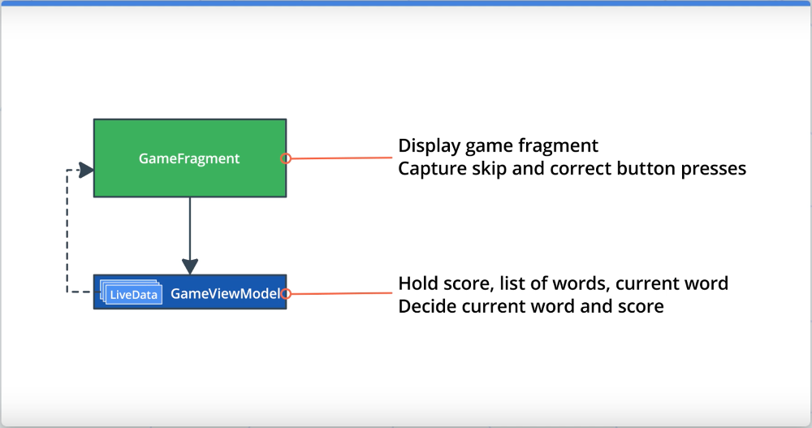

# Архитектура приложения

## Оглавление

- [Введение](#введение)
- [Шаблон Model-View-ViewModel](#шаблон-model-view-viewmodel)
- [ViewModel](#viewmodel)
- [LiveData](#livedata)

## Введение

Архитектура — одна из важнейших вещей при разработке программного продукта, будь то полноценное приложение для ПК, веб-приложенеи, мобильное приложение или что-то еще.  Архитектура в данном случае подразумевает то, что приложение разделено на несколько модулей, каждый из которых отвечает за что-то одно конкретное. Например, модуль с пользовательским интерфейсом приложения отвечает только за отображение элементов и данных на экране, модуль базы данных отвечает только за хранение данных в приложении, модуль уведомлений отвечает только за отправку уведомлений в конкретное время с конкретным сообщением и т.д.

Для каждой платформы существуют уже готовые шаблоны проектирования архитектуры, например шаблон "Модель-Вид-Контроллер", выделяющий три основные сущности: модель, содержащую данные; вид, отображающий данные; и контроллер, необходимый для взаимодействия между видом и данными (например, для выполнения каких-либо операций с данными).

Этот урок будет посвящен разработке архитектуры Adnroid-приложения по шаблону MVVM — Model-View-ViewModel. Подробнее о шаблоне будет далее.

В качестве примера используется приложение "Guess It", которое представляет собой игру для угадывания слов. Игрок берет в руки устройство, запускает приложение и оно отображает на экране слово, а второй игрок должен его угадать не глядя. Приложение дает некоторое время для угадывания, когда время заканчивается, игроку показывается количество очков (отгаданных слов). Также приложение позволяет пропустить слово и отметить, что оно отгадано.

Начальный код приложения не имеет полноценного функционала для игры, он не содержит таймера, который должен отсчитывать время, а страница с очками игрока отображается, когда игрок прошел по всем словам, что есть в приложении.

Проект приложения "Guess It" содержит следующее:

* Пустую активность `MainActivity`.
* Три фрагмента: `TitleFragment`, `GameFragment` и `ScoreFragment`.
* Граф навигации `main_navigation.xml`, содержащий навигацию `TitleFragment` -> `GameFragment` -> `ScoreFragment` -> `GameFragment`.

`TitleFragment` — начальный фрагмент приложения. Содержит лишь одну кнопку "Play", выполняющую переход к `GameFragment`.

`GameFragment` — основной фрагмент всей игры. Этот фрагмент содержит всю логику игры и содержит следующее:
* `word` — свойство, содержащее текущее отображаемое на экране слово.
* `score` — свойство, содержащее текущее количество очков.
* `wordList` — mutable-список (изменяемый) всех слов доступных для игры. Список инициализируется в методе `resetList()` и там же перемешивается, поэтому и является изменяемым.
* `resetList()` — метод для инициализации и перемешивания списка слов `wordList`.
* `onSkip()` и `onCorrect()` – методы обработчики нажатия на кнопки "Skip" и "Got It", соответственно.
* `nextWord()` — метод, выдающий следующее слово для угадывания. Если в списке `wordList` еще есть слова, то метод достает из списка следующее слово, сохраняет его в свойство `word` и удаляет слово из списка. Если же список `wordList` пуст, то вызывается метод `gameFinished()`.
* `gameFinished()` — метод, вызывающийся по окончанию игры, выполняет переход к `ScoreFragment` и передает в фрагмент количество набранных очков.

`ScoreFragment` — фрагмент, отображающий результат игры — количество набранных очков и кнопку для "Play Again" для повторного запуска игры.

Основная проблема с начальным кодом приложения в том, что при смене ориентации экрана данные (текущее слово, список слов и количество очков) сбрасываются. Эту проблему можно было бы решить с помощью `onSaveInstanceState()`, однако такое решение использовать не принято. В методах для сохранения и восстановления состояния потребуется писать много кода, также хранение данных в `Bundle` не удобно, количество типов и классов, объекты которых можно сохранять, также ограничено. 

Для решения проблемы сохранения состояния приложения используется библиотека Lifecycle Library, содержащая такие классы как `ViewModel`, `LiveData`, помогающие в работе с состоянием приложения и организовать удобную архитектуру приложения по шаблону MVVM.

## Шаблон Model-View-ViewModel

MVVM (Model-View-ViewModel) — это шаблон построения архитектуры Android-приложений.

**View** — это абстракция для `Activity`, `Fragment`а или любой другой собственной `View`. Не путать с классом `View`. Задача **View** — исключительно отображение данных. **View** не должна содержать в себе какой-либо логики по преобразованию данных, которые она должна отображать. Содержать данные View также не должна. Она должна хранить ссылку на экземпляр **ViewModel** и все данные, которые нужны **View**, должны поступать из **ViewModel**. Задача **View** — следить за данными и менять свой вид, когда данные из **ViewModel** меняются. Если кратко, то **View** отвечает за отображение и отслеживание изменений данных для layout'ов.

**ViewModel** — это компонент, содержащий данные и логику, когда данные должны быть получены и когда отображены на **View**. **ViewModel** хранит текущее состояние данных. Также **ViewModel** хранит ссылки на один или несколько экземпляров **Model**'ей, от которых получает данные. **ViewModel** не располагает информацией, откуда данные получены, будь то база данные или внешний сервер. Также **ViewModel** не должна ничего знать о **View**. **ViewModel** лишь является посредником между данными и видом.

**Model** — это абстракция для слоя, который подготавливает данные для **ViewModel**. **Model** — это класс, который получает данные из каких-либо источников (например, базы данных или сервера). Стоит отметить, что это не тот же класс, что, например, `User` или `Car`, которые обычно просто хранят какие-либо данные. **Model**-классы сложнее, они и получают данные, и подготавливают их для передачи в **ViewModel**. Соответственно **Model** не должна ничего знать о **ViewModel** и **View**.

Если шаблон MVVM реализуется в проекте правильно, это делает код более структурированным, удобным в тестировании и поддержке.

Если рассматривать приложение "Guess It", то, например, фрагмент `GameFragment` будет являться **View** в шаблоне MVVM, для этого **View** необходимо будет создать **ViewModel** и назвать класс `GameViewModel`. `GameViewModel` будет хранить очки игры, список слов и текущее отображаемое слово, а также логику по выбору текущего слово и подсчета очков.



## ViewModel

`ViewModel` — абстрактный класс, который служит для хранения данных интерфейса приложения и "переживает" изменения конфигурации системы. Так при смене ориентации экрана данные не будут потеряны, что избавляет от необходимости описания метода `onSaveInstanceState()`. 

Далее перейдем к реализации собственного `ViewModel`-класса.

**1. Добавление зависимости от библиотеки Lifecycle Library:**

Сперва необходимо добавить зависимость от `lifecycle-extensions`, модуля библиотеки Lifecycle Library, содержащего класс `ViewModel`.

```gradle
implementation 'androidx.lifecycle:lifecycle-extensions:2.0.0'
```

**2. Создание класса `GameViewModel`:**

Далее необходимо создать класс `GameViewModel` и унаследовать его от `ViewModel`. Добавить в класс блок `init` и переопределение метода `onCleared()`. Первый будет вызван при создании класса, второй — при уничтожении. Добавить в методы логирование.

```kotlin
class GameViewModel : ViewModel() {

    init {
        Log.i("GameViewModel", "GameViewModel created")
    }

    override fun onCleared() {
        super.onCleared()
        Log.i("GameViewModel", "GameViewModel destroyed")
    }
}
```

**3. Добавить инициализацию `GameViewModel` в `GameFragment`:**

Далее необходимо добавить экземпляр `GameViewModel` в класс `GameFragment`, чтобы **View** могло получать информацию и взаимодействовать с **ViewModel**. 

```kotlin

class GameFragment : Fragment() {

    private lateinit var viewModel: GameViewModel

    ...

    override fun onCreateView(inflater: LayoutInflater, container: ViewGroup?,
                              savedInstanceState: Bundle?): View? {
        ...
        Log.i("GameFragment", "Called ViewModelProvider.get")
        viewModel = ViewModelProvider(this).get(GameViewModel::class.java)

        resetList()
        nextWord()
        ...
    }
}
```

Экземпляр `viewModel` инициализируется с помощью вызова `ViewModelProvider.get()`. Вызов `ViewModelProvider.get()` создает новый экземпляр `viewModel` типа `GameViewModel`. В конструктор класса `ViewModelProvider` передается экземпляр текущего фрагмента, что позволяет в дальнейшем объекту `viewModel` отслеживать состояние жизненного цикла фрагмента.  
Первый раз вызов `ViewModelProvider.get()` выполняется при открытии экрана `GameFragment` и вызове метода `onCreateView()`. При смене ориентации экрана при повторном вызове `onCreateView()` вызов `ViewModelProvider.get()` вернет уже существующий экземпляр, вместо создания нового.

Если запустить приложение и перейти к экрану "Game", в лог будут выведены сообщения о вызове `ViewModelProvider.get()` и создании экземпляра `GameViewModel`. При смене ориентации в лог будет выведен уже только сообщение о `ViewModelProvider.get()`, но не сообщение о создании нового экземпляра `ViewModel`-класса, поскольку новый экземпляр не создается, а возвращается существующий. Это происходит, потому что экземпляр `ViewModel`-класса хранит свое состояние на протяжении всей жизни фрагмента. Если же выйти с экрана `GameFragment`, то будет вызван метод `onCleared()` класса `GameViewModel` и выведено сообщение об уничтожении экземпляра класса.

```
2020-02-17 23:38:26.575 com.example.android.guesstheword I/GameFragment: Called ViewModelProvider.get
2020-02-17 23:38:26.577 com.example.android.guesstheword I/GameViewModel: GameViewModel created
2020-02-17 23:38:38.526 com.example.android.guesstheword I/GameFragment: Called ViewModelProvider.get
2020-02-17 23:38:45.945 com.example.android.guesstheword I/GameFragment: Called ViewModelProvider.get
2020-02-18 00:05:57.594 com.example.android.guesstheword I/GameViewModel: GameViewModel destroyed
```

Класс `GameViewModel` должен содержать данные игры, в данном случае это текущее слово для игры, количество игровых очков и общий список слов для игр, т.е. поля `word`, `score` и `wordList`, соответственно. Таким образом поля необходимо из класса `GameFragment` перенести в класс `GameViewModel`. 

Далее необходимо в класс `GameViewModel` перенести методы, которые работают с перенесенными полями, а это `resetList()`, `nextWord()`, `onSkip()`, и `onCorrect()`.

Далее стоит заметить, что вызовы методов `resetList()` и `nextWord()` используются в методе `onCreateView()` при инициализации класса `GameFragment`. Поскольку эти методы перенесены в `GameViewModel`, то их вызов есть смысл поместить в блок `init` класса `GameViewModel`, который как раз будет вызван в рамках `GameViewModel.onCreateView()`.

Далее необходимо обновить код обработчиков нажатия на кнопки `onClickListener()` кнопок "Correct" и "Skip". Необходимо использовать объект `viewModel` для вызова `onCorrect()` и `onSkip()`, а также перенести вызовы `updateWordText()` и `updateScoreText()`, поскольку в классе `GameViewModel` их нет. А нет из там потому, что они выполняют обновление вида в связи с обновленными данными и на уровне `ViewModel`-класса не должны находиться.

```kotlin
override fun onCreateView(inflater: LayoutInflater, container: ViewGroup?,
                              savedInstanceState: Bundle?): View? {
    ...

    binding.correctButton.setOnClickListener {
        viewModel.onCorrect()
        updateWordText()
        updateScoreText()
    }
    binding.skipButton.setOnClickListener {
        viewModel.onSkip()
        updateWordText()
        updateScoreText()
    }
    ...
}
```

Далее необходимо обновить методы в `GameFragment`, где используются поля `word` и `score`. Сделать поля НЕ приватными и использовать доступ к ним через объект `viewModel` в методах класса `GameFragment`.

В итоге необходимо подчистить код класса `GameViewModel`. Так, например, в классе используется метод `gameFinished()` определенный во фрагменте. Однако, `ViewModel`-класс не должен содержать ссылок на фрагмент, поэтому на данный момент вызов этого метода необходимо закомментировать.

Если на текущем этапе запустить приложение можно заметить, что игра идет, однако, не заканчивается несмотря на то, что общее число слов для игры заканчивается. Однако, если проверить смену ориентации устройства, то можно убедиться, что проблем со сбросом данных нет.

**Преимущества реализации архитектуры:**

* Код более структурированный, организованный, им проще управлять.
* Легче отлаживать.
* Нет необходимости следить за состоянием **ViewModel**. Состояние не теряется.
* **ViewModel** не содержит зависимостей от фрагментов и активностей, что упрощает unit-тестирование.

## LiveData

// In Progress
