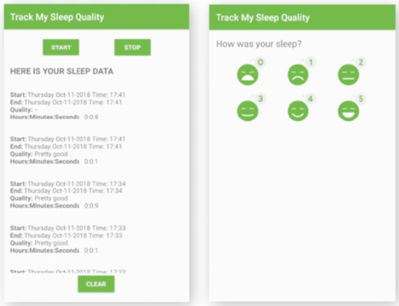
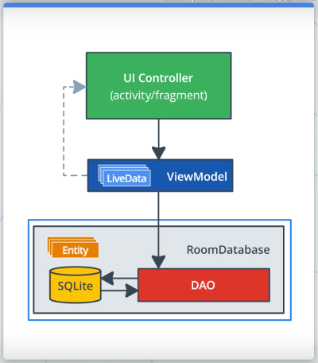
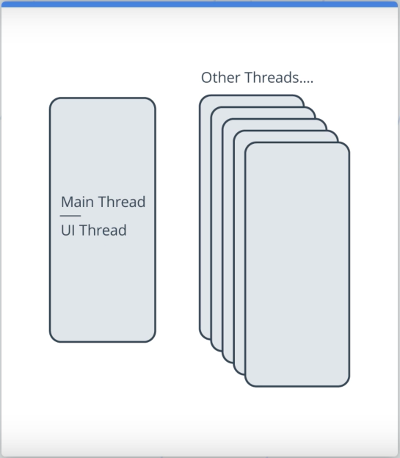
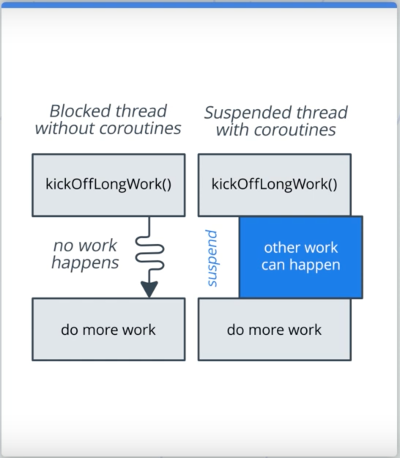

# Архитектура приложения (хранение данных)

## Оглавление

- [Введение](#введение)
- [Объявление объектов базы данных](#объявление-объектов-базы-данных)
- [Data Access Object](#data-access-object)
- [Создание базы данных `Room`](#создание-базы-данных-room)
  - [Создание класса базы данных `SleepDatabase`](#cоздание-класса-базы-данных-sleepdatabase)
  - [Тестирование работоспособности `SleepDatabase`](#тестирование-работоспособности-sleepdatabase)
  - [Добавление ViewModel с классом базы данных](#добавление-viewmodel-с-классом-базы-данных)
- [Многопоточность и корутины](#многопоточность-и-корутины)
  - [Многопоточность](#многопоточность)
  - [Корутины](#корутины)
  - [Добавление корутин в приложение](#добавление-корутин-в-приложение)
  - [Отображение данных из БД](#отображение-данных-из-бд)

## Введение

Продолжение урока об архитектуре приложения будет посвящено хранению данных и работе с базой данных.

По ходу урока будет доработано приложение "Sleep Tracker" помогающее следить за сном и его состоянием.  
На главном экране приложения располагаются кнопки "Start" и "Stop" для запуска таймера сна, а также список записей с информацией о сне. После остановки таймера сна приложение отображает экран "Quality", позволяющий оценить качество сна. После оценки, новая запись добавляется в список. Кнопка "Clear" на главном экране служит для очистки данных.



Архитектура приложения, использующего базу данных будет похожа на ту, что использовалась ранее. Единственное отличие заключается в том, что здесь **ViewModel** взаимодействует с базой данных **Room**.


`Room` — это высокоуровневый интерфейс для работы с базой данных SQLite, встроенный в Android. `Room` выполняет большую часть своей работы во время компиляции, создавая API-интерфейс поверх встроенного SQLite API, что избавляет от необходимости работать с устаревшими `Cursor` и `ContentResolver`.

В этом уроке будет рассмотрено как:

* Использовать `Room` для работы с базой данных.
* Создавать объект доступа к данным (DAO) и использовать его для выполнения запросов к БД.
* Использовать `Room` в рамках шаблона архитектуры MVVM.
* Ускорить работу с БД с помощью отдельных потоков (Coroutines).

**Обзор стартового кода приложения-примера:**

В Gradle-файле модуля `app` уже включены все необходимые зависимости: Room, Lifecycle Library, Coroutines.

```gradle
// Room and Lifecycle dependencies
implementation "androidx.room:room-runtime:$version_room"
kapt "androidx.room:room-compiler:$version_room"
implementation "androidx.lifecycle:lifecycle-extensions:$version_lifecycle_extensions"

// Coroutines
implementation "org.jetbrains.kotlinx:kotlinx-coroutines-core:$version_coroutine"
implementation "org.jetbrains.kotlinx:kotlinx-coroutines-android:$version_coroutine"
```

Код приложения сгруппирован в каталогах по функциональности. В каталоге `sleeptracker` содержатся классы, относящиеся к начальному экрану "Sleep Tracker". В каталоге `sleepquality` содержатся классы для функционала экрана "Sleep Quality". В каталоге `database` содержатся классы для работы с БД. Изначально они пустые.

Файл `Util.kt` содержит вспомогательные функции для работы со значениями качества сна, форматирования строки с датой и временем для отображения, а также закомментированный код, который использует экземпляр `ViewModel` и будет раскомментирован в ходе работы.

Данный урок предполагает, что читатель знаком с базами данных и SQL-синтаксисом.

## Объявление объектов базы данных

При использовании `Room` для работы с базой данных необходимо знание о двух основных понятиях: entities (объектах, сущностях) и queries (запросах).

Entity представляет собой объект или концепт, хранимый в базе данных. Entity-класс определяет таблицу базы данных, а каждый экземпляр такого класса — одну строку таблицы. Например, класс `Person`, описывающий таблицу `person` базы данных, будет являться entity-классом.

Query — это запрос на получение, добавление, изменение или удаление данных из таблицы или нескольких таблиц базы данных. Пример: запрос `SELECT` на получение всех записей из некоторой таблицы.

Использование `Room` значительно упрощает процесс объявления и использования entity-классов и запросов.

В приложении "Sleep Tracker" в качестве Entity-класса будет класс-модель `SleepNight`, содержащий информацию о сне: дату и время начала сна, дату и время его окончания, а также его качество. Кроме, этого в классе будет описано поле `nightId`, которое будет содержать идентификатор записи в таблице.

```kotlin
@Entity(tableName = "sleep_quality_table")
data class SleepNight(
    
    @PrimaryKey(autoGenerate = true)
    @ColumnInfo(name = "id")
    var nightId: Long = 0L,

    @ColumnInfo(name = "start_time_millis")
    val startTimeMillis: Long = System.currentTimeMillis(),

    @ColumnInfo(name = "end_time_millis")
    var endTimeMillis: Long = startTimeMillis,

    @ColumnInfo(name = "sleep_quality")
    var sleepQuality: Int = -1
)
```

Для объявления класса как описания таблицы базы данных используется аннотация `@Entity`, куда в качестве параметра передается имя таблицы. По общепринятому соглашению по именованию таблиц баз данных имя таблицы указывается с использованием подчеркивания в качестве разделителя между словами. Если в аннотации `@Entity` не указать вручную имя таблицы, тогда в качестве имени будет использоваться имя класса, однако оно не будет соответствовать соглашению об именовании таблиц баз данных.

Для объявления столбцов таблицы, достаточно просто описать свойства класса в его конструкторе. Таким образом столбцы таблицы будут иметь те же имена, что и поля класса. Однако, такие поля также не соответствуют соглашению об именовании, и поэтому используются аннотации `@ColumnInfo` с параметром `name` для указания имени столбца вручную с использованием подчеркиваний.

Аннотация `@PrimaryKey` используется для указания того, что поле является ключом таблицы. В данном случае это поле `nightId` типа `Long`. Также устанавливается параметр `autoGenerate`, определяющий, что новый ключ будет генерироваться автоматически при добавлении новой записи в таблицу.

Таким образом создается класс `SleepNight`, описывающий таблицу базы данных `sleep_quality_table` с 4-мя столбцами: `id`, `start_time_millis`, `end_time_millis` и `sleep_quality`.

## Data Access Object

Во время использования базы данных возникает необходимость выполнения запросов к ней, например, на добавление или изменение данных, на удаление данных, а также на получение данных из базы, а зачастую еще и на получение с определенными условиями. Чтобы упростить работу с базой данных и особенно с выполнением запросов к ней, было придумано понятие объекта доступа к данным или Data Access Object, или коротко DAO.

Обычно DAO-классы — это классы, содержащие методы для работы с базой данных и выполнения запросов к ней. Снаружи интерфейс таких классов выглядит как набор методов, выполняющих определенные операции (запросы к БД), а внутри же каждого из методов описана логика выполнения запроса к БД и получения ответа от нее.

Библиотека `Room` предлагает свое определение DAO-классов, вернее DAO-интерфейсов. Здесь описание DAO является описанием интерфейса с методами, а не класса. А основная логика выполнения запросов прячется за определением аннотаций.

`Room` предоставляет следующие DAO-аннотации: `@Insert`, `@Update`, `@Delete`, а также `@Query`. Первые три используются для выполнения SQL-запросов `INSERT`, `UPDATE` и `DELETE`. Аннотация `@Query` позволяет описать любой запрос, поддерживающийся в SQLite.

В приложении "Sleep Tracker" уже создан интерфейс `SleepDatabaseDao`, но он пуст. Необходимо добавить описание методов для:

* Добавления новой записи о сне.
* Обновления существующей записи о сне.
* Получения существующей записи по ее ключу.
* Удаления всех записей из БД.
* Получения всех записей о снах.
* Получения последней добавленной записи о сне.

**1. Добавление интерфейса с описанием DAO:**

Для добавления нового DAO-интерфейса необходимо создать новый интерфейс и пометить его аннотацией `@Dao`.

В стартовом приложении уже есть интерфейс `SleepDatabaseDao`, поэтому необходимо лишь добавить для него фигурные скобки блока интерфейса и аннотацию.

```kotlin
@Dao
interface SleepDatabaseDao {

}
```

**2. Добавление метода `insert()`:**

Метод, который будет выполнять добавление новой записи о сне в БД, будет называться `insert()`. В качестве параметра метод принимает экземпляр `SleepNight`, который описан как сущность (entity) нашей базы данных.  
Для того, чтобы этот метод выполнял запрос `INSERT` к БД, необходимо добавить к методу аннотацию `@Insert`. Во время компиляции проекта `Room` сгенерирует код по аннотации, который будет корректно выполнять запрос `INSERT` при вызове этого метода. Сгенерированный код, будет разбирать полученный объект `SleepNight` на строки таблицы, которой объект принадлежит и выполнять запрос.

```kotlin
@Insert
fun insert(night: SleepNight)
```

**3. Добавление метода `update()`:**

Для обновления записей в БД добавляется метод `update()` и помечается аннотацией `@Update`. Метод будет выполнять запрос `UPDATE` к базе данных. Все работает аналогично методу `insert()`.

```kotlin
@Update
fun update(night: SleepNight)
```

**4. Добавление метода `get()`:**

Метод для получения записи из базы по ее ключу будет называться `get()`. Поскольку ни `@Insert`, ни `@Update`, ни `@Delete`, не подходят для выполнения запроса `SELECT` на получение данных, поэтому здесь будет использоваться аннотация `@Query`.

```kotlin
@Query("SELECT * FROM sleep_quality_table WHERE id = :key")
fun get(key: Long): SleepNight?
```

Аннотация `@Query` принимает в качестве параметра строку с запросом, который необходимо выполнить. В данном случае — это запрос `SELECT *` на получение всех записей из таблицы `sleep_quality_table` с полем `id` равным переданному в метод параметру `key`. После компиляции также будет автоматически сгенерирован код по аннотации `Query`, который будут выполнять описанный в аннотации запрос к БД.

К слову, если SQL-запрос написан с ошибкой, то среда подкрасит запрос красным, но собрать проект будет возможно.

**5. Добавление метода `clear()`:**

Метод для удаления всех записей о сне из таблицы будет называться `clear()` и он также будет помечен аннотацией `@Query`. С описанием запроса.

```kotlin
@Query("DELETE FROM sleep_quality_table")
fun clear()
```

В данном случае не используется аннотация `@Delete` по той причине, что запрос эта аннотация используется для удаления лишь одной конкретной записи с указанием конкретного экземпляра `SleepNight` или списка экземпляров в качестве параметра метода. Здесь же запрос удаляет все данные из конкретной таблицы и его можно описать только с помощью аннотации `@Query`.

**6. Добавление метода `getAllNights()`:**

Метод для получения списка всех записей сна будет называться `getAllNights()` и будет возвращать объект `LiveData` со списком объектов `SleepNight`. К методу также добавлена аннотация `@Query`, описывающая запрос `SELECT` по получению записей из таблицы и сортировке данных по убыванию `id`. Таким образом самые новые записи будут самыми первыми.

```kotlin
@Query("SELECT * FROM sleep_quality_table ORDER BY id DESC")
fun getAllNights(): LiveData<List<SleepNight>>
```

Тип `LiveData` будет использоваться далее для отслеживания изменений в таблице БД и обновления вида. Возможность возвращать данные, обернутые в `LiveData` — одна из самых полезных функций `Room`.

**7. Добавление метода `getTonight()`:**

В завершении будет добавлен метод для получения последней добавленной записи `getTonight()`. Метод также будет помечен аннотацией `@Query` с описанием запроса. Запрос похож на тот, что описан в методе по получению всех записей. Отличие в том, что здесь используется параметр `LIMIT 1` для гарантированного получения лишь одной записи, а не списка.

```kotlin
@Query("SELECT * FROM sleep_quality_table ORDER BY id DESC LIMIT 1")
fun getTonight(): SleepNight?
```

Таким образом был описан DAO-интерфейс с использованием аннотаций библиотеки `Room`, упрощающих описание запросов к базе данных.  
В конце, чтобы убедиться, что сборка проходит и приложение не падает, можно его запустить.

## Создание базы данных `Room`

Теперь, когда созданы классы сущности (entity) и DAO, можно перейти к добавлению базы данных. Для этого необходимо реализовать абстрактный класс унаследованный от `RoomDatabase` помеченный аннотацией `@Database`.



### Создание класса базы данных `SleepDatabase`

Для создания класса базы данных необходимо:

* Создать абстрактный класс наследованный от `RoomDatabase`. Класс абстрактный, т.к. `Room` создаст его реализацию для на самостоятельно при компиляции.
* Пометить класс аннотацией `@Database` с передачей в качестве параметров список сущностей (entity) для создания таблиц БД, а также версии БД.
* Объявить абстрактный метод для получения экземпляром DAO-класса. `Room` также сгенерирует его реализацию.
* Сделать класс синглтоном, т.е. создать статическое поле с объектом текущего класса базы данных и метод инициализирующий и возвращающий его.

**1. Добавление абстрактного класса `SleepDatabase`:**

В стартовом приложении уже создан пустой файл `SleepDatabase.kt`. В него необходимо добавить объявление абстрактного класса `SleepDatabase` с аннотацией `@Database`.

```kotlin
@Database(entities = [SleepNight::class], version = 1, exportSchema = false)
abstract class SleepDatabase : RoomDatabase() {
}
```

В параметрах аннотации описывается:

* список сущностей (entities-классов); 
* версия базы данных, которая должна меняться, когда БД претерпевает изменения в разных версиях приложения;
* параметр `exportSchema`, определяющий должна ли схема БД быть экспортирована в каталог проекта. По умолчанию значение `true`, но в этом простейшем примере нет необходимости куда-то экспортировать схему БД.

**2. Добавление объявления абстрактного метода для получения экземпляра DAO:**

```kotlin
abstract fun getSleepDatabaseDao(): SleepDatabaseDao
```

**3. Добавление статического поля `SleepDatabase`:**

Далее предлагается сделать класс `SleepDatabaseDao` синглтоном, т.е. классом, хранящим собственный экземпляр внутри себя в виде статического поля. Таким образом состояние объекта будет одним и тем же во всем приложении независимо от класса, в котором `SleepDatabaseDao` используется. 

```kotlin
companion object {
    @Volatile
    private var INSTANCE: SleepDatabase? = null   
}
```

Статические классы и методы объявляются внутри блока `companion object`. Здесь объявляется поле `INSTANCE` типа `SleepDatabase`. Поле `INSTANCE` является экземпляром созданного класса базы данных.

Аннотация `@Volitile` помечает поле как поле доступное всем имеющимся потокам приложения. То есть это поле будет доступно в рамках всех потоков приложения, в том числе и основного UI-потока. Изменение поля помеченного `@Volitile` будет видно мгновенно во всех потоках. Таким образом можно избежать проблемы, когда два потока используют поле и его данные, но в одном потоке данные актуальны, а во втором не синхронизированы, что может приводить к проблемам.

**4. Добавление метода для получения экземпляра класса `SleepDatabase`:**

Для получения экземпляра синглтона `SleepDatabase` в рамках приложения необходимо добавить класс, который будет инициализировать поле `INSTANCE` если оно `null` и возвращать его, либо возвращать поле без инициализации, если объект уже был создан ранее.

```kotlin
fun getInstance(context: Context): SleepDatabase {
    synchronized(this) {
        var instance = INSTANCE
        if (instance == null) {
            instance = Room.databaseBuilder(context.applicationContext,
                    SleepDatabase::class.java, "sleep_tracker_db")
                    .build()
            INSTANCE = instance
        }
        return instance
    }
}
```

Метод `getInstance()` принимает на вход экземпляр класса `Context`, например, экземпляр активности. Контекст необходим для создания экземпляра класса БД `SleepDatabase` с помощью `Room`.  

Весь код метода описан в блоке `synchronized {}`. Если база данных, а следовательно и объект `SleepDatabase`, используется несколькими потоками, то описание блока `synchronized {}` позволяет выполнять кусок кода только в рамках одного потока. Остальные потоки будут дожидаться момента, когда первый поток закончит выполнение описанного блока, и только тогда код станет доступен для остальных потоков. Таким образом блок `sunchronized {}` позволяет избежать ошибок множественного доступа к синглтон-объекту разными потоками.

В рамках блока `synchronized {}` описывается инициализация поля `INSTANCE`. Сперва инициализируется временное поле `instance` значением поля `INSTANCE`. Далее проверяется было ли поле проинициализировано ранее, и если нет, то инициализируется с помощью вызова `Room.databaseBuilder().build()`. В качестве параметров передается контекст приложения, класс `SleepDatabase` и имя файла базы данных, которое должно быть присвоено.

После создания экземпляра БД во временной переменной, переписываем ее в поле `INSTANCE` и возвращаем значение временной переменной. Таким образом метод `getInstance()` позволяет получать экземпляр класса базы данных `SleepDatabase`. При этом, если экземпляр не был создан ранее, он будет создан.

Манипуляции с временными переменными используются для того, чтобы избежать ситуации, когда в процессе выполнения метода поле какой-нибудь из потоков изменит значение поля `INSTANCE` на `null`. Если не использовать временной переменной, то компилятор не позволит собрать такой код.

Таким образом синглтон-создается класс для инициализации и доступа к базе данных. Код должен успешно собираться, однако пока неясно работает ли он.

### Тестирование работоспособности `SleepDatabase`

Для проверки работоспособности кода можно выполнить уже добавленные в стартовый код тест. Для этого необходимо перейти в файл `SleepDatabaseTest.kt` и раскомментировать весь код.

Код тестов содержит метод `createDb()` помеченный аннотацией `@Before`. Аннотация объявляет данный метод как тот, что будет вызван перед выполнением каждого теста. Здесь инициализируется объект `SleepDatabase` с помощью метода `inMemoryDatabaseBuilder()`. Метод создаст временную БД, которая будет хранится в памяти устройства и будет удалена автоматически после завершения тестов. Метод `allowMainThreadQueries()` позволяет выполнять запросы к БД на главном потоке приложения. По умолчанию это не разрешено, т.к. выполнение запросов на главном потоке блокирует выполнение остальных операций. Вызов же метода `allowMainThreadQueries()` разрешает выполнение запросов на главном потоке. Однако, когда запросов становится много это может значительно замедлять работу приложения.

```kotlin
@Before
fun createDb() {
    val context = InstrumentationRegistry.getInstrumentation().targetContext
    db = Room.inMemoryDatabaseBuilder(context, SleepDatabase::class.java)
            // Allowing main thread queries, just for testing.
            .allowMainThreadQueries()
            .build()
    sleepDao = db.getSleepDatabaseDao()
}
```

Метод `closeDb()` выполняет закрытие соединения с БД и т.к. он помечен аннотацией `@After` он будет выполнен после каждого теста.

```kotlin
@After
@Throws(IOException::class)
fun closeDb() {
    db.close()
}
```

Метод же помеченный аннотацией `@Test` является методом-тестом. Здесь такой метод проверяет корректность работы DAO по добавлению новой записи в БД. Метод создает новый объект `SleepNight`, использует объект DAO для выполнения запроса `INSERT` к БД, затем достает из БД последнюю добавленную запись и проверяет значение ее поля `sleepQuality` на соответствие значению по умолчанию, т.к. вручную значение для поля не задавалось.

```kotlin
@Test
@Throws(Exception::class)
fun insertAndGetNight() {
    val night = SleepNight()
    sleepDao.insert(night)
    val tonight = sleepDao.getTonight()
    assertEquals(tonight?.sleepQuality, -1)
}
```

Для запуска тестов необходимо нажать на файле правой кнопкой мыши и выбрать `Run`.

### Добавление ViewModel с классом базы данных

Для работы с базой данных в рамках шаблона MVVM необходимо добавить `ViewModel`-класс с объектом DAO внутри.

**1. Описание класса `SleepTrackerViewModel`:**

В стартовом коде приложения уже создан класс `SleepTrackerViewModel`.

```kotlin
class SleepTrackerViewModel(
    val dao: SleepDatabaseDao,
    application: Application) : AndroidViewModel(application) {
}
```

Класс `SleepTrackerViewModel` наследуется от `AndroidViewModel`. Класс `AndroidViewModel` является расширеним стандартного `ViewModel`. Отличие заключается в том, что конструктор должен принимать в качестве параметра экземпляр класса `Application`. Такое расширение может быть полезным в случаях, когда нам нужно использовать контекст приложения, например, для доступа к ресурсам приложения.

Конструктор класса `SleepTrackerViewModel` принимает на вход два параметра: объект класса `SleepDatabaseDao`, являющийся свойством класса, а также непосредственно объект `Application`, передающийся в конструктор `AndroidViewModel`.

**2. Описание класса `SleepTrackerViewModelFactory`:**

Поскольку класс `SleepTrackerViewModel` содержит конструктор с параметром, для создания объекта класса необходимо описать factory-класс `SleepTrackerViewModelFactory`. В стартовом коде приложения такой класс уже добавлен.

```kotlin
class SleepTrackerViewModelFactory(
        private val dao: SleepDatabaseDao,
        private val application: Application) : ViewModelProvider.Factory {
    override fun <T : ViewModel?> create(modelClass: Class<T>): T {
        if (modelClass.isAssignableFrom(SleepTrackerViewModel::class.java)) {
            return SleepTrackerViewModel(dao, application) as T
        }
        throw IllegalArgumentException("Unknown ViewModel class")
    }
}
```

Класс `SleepTrackerViewModelFactory` наследуется от `ViewModelProvider.Factory`. Конструктор класса также принимает объекты DAO и контекста приложения, которые передаются в конструктор `SleepTrackerViewModel`.

**2. Добавление ViewModel в фрагмент:**

Для добавления `ViewModel` необходимо добавить свойство `viewModel` класса `SleepTrackerFragment` и инициализировать его в методе `onCreateView()`.

```kotlin
// SleepTrackerFragment

private lateinit var viewModel: SleepTrackerViewModel

override fun onCreateView(inflater: LayoutInflater, container: ViewGroup?,
                          savedInstanceState: Bundle?): View? {

    ...

    val application = requireNotNull(this.activity).application
    val dao = SleepDatabase.getInstance(application).getSleepDatabaseDao()
    val viewModelFactory = SleepTrackerViewModelFactory(dao, application)
    viewModel = ViewModelProvider(this, viewModelFactory)
            .get(SleepTrackerViewModel::class.java)

    ...
}
```

В методе `onCreateView()` сперва инициализируется объект `application`, который содержит контекст приложения и который необходимо передать в конструктор `SleepTrackerViewModel`. Экземпляр объекта можно получить из экземпляра активности, внутри которой содержится фрагмент. Здесь используется метод `requireNotNull()` для проверки экземпляра активности на `null`, и если активность содержит `null`, то метод выкинет исключение с сообщением об этом. В нормальной ситуации такого произойти не должно, но поскольку система Android может сама "убивать" активности, то предосторожность не помешает в данном случае.

Далее инициализируется объект DAO. Получение объекта выполняется с помощью статического вызова метода `getInstance(application).getSleepDatabaseDao()` класса базы данных `SleepDatabase`. Вызов метода `getInstance()` инициализирует или возвращает уже проинициализированный ранее экземпляр объекта базы данных `SleepDatabase`, а метод `getSleepDatabaseDao()` возвращает экземпляр DAO. Стоит напомнить, что метод описан как абстрактный, но при сборке `Room` генерирует его реализацию автоматически.

Далее создается объект `SleepTrackerViewModelFactory` с передачей в конструктор экземпляров DAO и контекста приложения, необходимых для инициализации `ViewModel`-класса. И в завершении инициализируется объект `viewModel` с помощью вызова `ViewModelProvider().get()`.

Таким образом реализуется и описывается `ViewModel`-класс с объектом DAO внутри и его инициализация в фрагменте.

## Многопоточность и корутины

Классы для работы с базой данных подготовлены. Теперь необходимо перейти к реализации функционала приложения: реализации функционала кнопок, добавлению списка записей на основной экран.

По нажатию на кнопку "Start" в базу данных должна добавляться новая запись.  
По нажатию на кнопку "Stop" у последней записи в базе данных должно обновляться поле, обозначающее окончания времени сна.  
По нажатию на кнопку "Clear" из базы данных должны удаляться все записи.

### Многопоточность

Операции записи и чтения данных из БД являются длительными, когда записей становится достаточно много. По этой причине принято выделять выполнение подобных операций в отдельные потоки.

Современные мобильные устройства имеют несколько процессоров. Каждый процессор выполняет одновременно по несколько процессов. Процессами могут быть сами приложения или, например, выполнение каких-либо системных служб. В свою очередь каждый процесс может создавать множество потоков для выполнения тех или иных операций. Это и называется многопоточностью.

Например, можно представить человека, который читает одновременно три книги, переключаясь между ними после каждой главы. В этом примере читатель является процессом, а книги — тремя отдельными потоками выполнения.

В Android каждое приложение выполняется на главном потоке приложения, также этот поток называется UI-потоком, т.к. именно на этом потоку выполняются все операции, касающиеся пользовательского интерфейса. Кроме этого главный поток обновляет экран каждый 16 миллисекунд, что позволяет пользовательскому интерфейсу быть плавным и гладким.



Если на главном потоке будут выполняться длительные операции, например, запросы к БД с большим числом записей, то выполнение главного потока будет блокироваться. Т.е. на главном потоке не будет выполняться ничего до тех пор пока длительная операция не будет завершена, что приведет к подтормаживаниям интерфейса. 

Множество операций, которые выполняются в приложении — сложные и занимают по времени более, чем 16 миллисекунд. Например, выполнение сетевых запросов и ожидание ответов, чтение файлов или операции доступа к данным в БД. Таким образом выполнение длительных операций на главном потоке является запретным. Для таких операций создаются отдельные потоки, выполняющиеся в фоне и не занимающие главный поток.

### Корутины

В Kotlin для элегантной и эффективной обработки длительных задач используются корутины. Корутины — это способ написания асинхронного, неблокирующего кода.

Выдержка с описанием корутин из документации:

> Корутины можно представить в виде облегчённого потока. Подобно потокам, корутины могут работать параллельно, ждать друг друга и общаться. Самое большое различие заключается в том, что корутины очень дешевые, почти бесплатные: мы можем создавать их тысячами и платить очень мало с точки зрения производительности. Потоки же обходятся дорого. Тысяча потоков может стать серьезной проблемой даже для современной машины.

Корутины обладают тремя основными характеристиками:

* Асинхронность,
* Они не блокируют главный поток,
* Позволяют использовать прерываемые функции, выполняя код последовательно.

**1. Асинхронность**

Асинхронность означает, что корутины запускаются независимо от главного потока выполнения и того, что на нем выполняется. Корутины выполняются параллельно главному потоку и не мешают его выполнению, в том числе.

Основной аспект асинхронности заключается в том, что нет необходимости в явном беспрерывном ожидании окончания выполнения и результата во время выполнения работы корутины. Например, если у вас есть некоторый сложный вопрос и вы задаете его коллегам, то нет необходимости останавливать свою работу пока коллеги на протяжении длительного времени работают и ищут ответ на ваш вопрос. В это время можно сделать работу, которая не зависит от ответа на ваш вопрос. По этому же принципу работают корутины, они позволяют выполнять некоторую работу (как поиск ответа на вопрос) параллельно, не мешая основной работе.

**2. Корутины не блокируют главный поток**

Корутины не блокируют главный поток выполнения приложения. Таким образом анимации приложения всегда будут плавными.

**3. Функции приостановки**

Поскольку код корутин компилируется из последовательного кода, нет необходимости использовать callback-функции для обработки результата выполнения отдельного потока.

Ключевое слово `suspend` используется в Kotlin для того, чтобы пометить функцию как доступную для использования корутинами.

Когда корутина вызывает функцию помеченную как `suspend`, вместо блокирования выполнения основного потока, функция просто приостанавливает его выполнение до тех пор, пока результат ее выполнения не будет готов. После получения результата, выполнение продолжается. В то время, пока выполнение главного потока приостановлено, некоторая другая работа может выполняться параллельно.



Таким образом разница между блокированием и приостановкой заключается в том, что когда поток заблокирован, никакая другая работа не может выполняться (на изображении слева), а когда поток приостановлен любая работа может выполняться параллельно пока результат не будет доступен.

Стоит обратить внимание, что ключевое слово `suspend` не означает, что для выполнения функции будет создан отдельный поток. Функции помеченные `suspend` выполняются либо на главном потоке, либо в фоновом потоке.

Далее. Для использования корутин в коде, необходимо несколько вещей:

* `Job`,
* `Dispatcher`,
* `Scope`.

**1. `Job`**

`Job` — это вещь, которую можно завершить и при этом завершится ее жизненный цикл. Все корутины имеют Job и их можно использовать для завершения выполнения корутин. Объекты `Job` могут иметь иерархию типа родитель-ребенок, таким образом при завершении родительского Job, его "дети" тоже будут завершены.

**2. `Dispatcher`**

`Dispatcher` (диспетчер) используется для запуска корутин на разных потоках. Например, диспетчер `Dispatchers.Main` запускает корутины на главном потоке выполнения, а диспетчер `Dispatchers.IO` используется для выгрузки блокирующих задач ввода/вывода в общий пул потоков.

**3. `Scope`**

`Scope` объединяет в себе информацию о диспетчере и Job-объекте для определения контекста, в котором корутина запускается. `Scope` всегда содержит информацию о корутинах. `Scope` позволяет отслеживать выполнение корутин. Когда запускается корутина, она запускается в `scope`. Это означает, что вы определяете какой `scope` будет отслеживать выполнение корутины.

Для большего понимания концепции корутин рекомендуется ознакомиться с документацией:

Coroutines: https://kotlinlang.org/docs/reference/coroutines-overview.html  
Coroutine context and dispatchers: https://kotlinlang.org/docs/reference/coroutines/coroutine-context-and-dispatchers.html  
Dispatchers: https://kotlin.github.io/kotlinx.coroutines/kotlinx-coroutines-core/kotlinx.coroutines/-dispatchers/index.html  
Job: https://kotlin.github.io/kotlinx.coroutines/kotlinx-coroutines-core/kotlinx.coroutines/-job/

### Добавление корутин в приложение

Перейдем к добавлению корутин в код приложения.

Начать необходимо с класса `SleepTrackerViewModel`. Именно этот класс будет заниматься работой с базой данных, управлением DAO и именно здесь необходимо использовать корутины для асинхронной работы с БД.

**1. Добавление свойства `Job`:**

Для управления корутинами необходимо добавить свойство класса `Job` в класс.

```kotlin
class SleepTrackerViewModel(
        val dao: SleepDatabaseDao,
        application: Application) : AndroidViewModel(application) {

    private var viewModelJob = Job()
}
```

**2. Завершение корутин, когда `ViewModel` уничтожается:**

Объект `viewModelJob` позволит завершать корутины, которые будут создаваться в данном `ViewModel`-классе. Когда `ViewModel` будет уничтожен, нам необходимо остановить выполнение всех корутин. Для этого необходимо переопределить метод `onCleared()`, и вызвать завершение на объектке `viewModelJob`.

```kotlin
override fun onCleared() {
    super.onCleared()
    viewModelJob.cancel()
}
```

**3. Добавление свойства `Scope`:**

Далее необходимо добавить свойство `uiScope` для запуска корутин. Свойству необходимо знать на каком потоке будет выполняться корутина, и какой объект `Job` будет завершать ее выполнение.

Для создания `Scope` используется класс `CoroutineScope`, принимающий на вход экземпляр диспетчера для главного потока выполнения и объект `Job`.

```kotlin
private val uiScope = CoroutineScope(Dispatchers.Main +  viewModelJob)
```

Использование главного потока для выполнения корутин в рамках работы с `ViewModel` считается подходящим решением, поскольку это удобно для реализации обновления UI после выполнения операций с данными.

**4. Объявление свойств с данными:**

Далее необходимо объявить свойства класса `SleepTrackerViewModel`, которые будут содержать данные.

Во-первых, это поле `tonight`, которое будет содержать данные о последнем добавленном (текущем) сне.  
Во-вторых, это поле `nights`, которое будет содержать список из всех, имеющийся в БД, записях о снах.

```kotlin
private var tonight = MutableLiveData<SleepNight?>()
private val nights = dao.getAllNights()
```

Свойство `tonight` является классом `MutableLiveData`. `LiveData` — поскольку требуется отслеживать обновления, а `Mutable` — поскольку свойство должно быть изменяемым.

Свойство `nights` при объявлении инициализируется списком записей, полученных из БД с помощью DAO. Объект `SleepDatabaseDao` возвращает список, обернутый в `LiveData`, поэтому отдельно объявлять, что свойство `nights` является `LiveData` нет необходимости. Будут отслеживаться изменения непосредственно в базе данных.

**5. Инициализация `tonight` с использованием корутин:**

Далее необходимо проинициализировать свойство `tonight` записью, получаемой из базы данных. Инициализация выполняется в блоке `init`.

```kotlin
init {
    initializeTonight()
}

private fun initializeTonight() {
    uiScope.launch {
        tonight.value = getTonightFromDatabase()
    }
}

```

Внутри метода `initializeTonight()` используется корутина для получения записи из базы данных без блокирования выполнения главного потока. Для выполнения такой операции требуется `Scope` — `uiScope`. В рамках этого `Scope` запускается корутина с помощью вызова `launch`. Запуск корутины создает новую корутину без блокирования текущего потока в контексте, определенном при создании `Scope`. Работа корутины будет завершена, когда будет выполнен код, описанный в блоке `launch`. В данном случае это получение записи о текущем сне из базы данных и иницализация значения свойства `tonight`.

Далее необходимо добавить метод `getTonightFromDatabase()` и убедиться, что его выполнение не будет блокировать выполнение потока. Кроме этого метод должен возвращать экземпляр записи БД `SleepNight`.

```kotlin
private suspend fun getTonightFromDatabase(): SleepNight? {
    return withContext(Dispatchers.IO) {
    	var night = dao.getTonight()
        if (night?.endTimeMillis != night?.startTimeMillis) {
            night = null
        }
        night
    }
}
```

Ключевое слово `suspend` позволяет использовать метод внутри корутины и не блокировать при этом поток.

Для получения и возврата записи о текущем сне необходимо создать еще одну корутину в контексте ввода-вывода, т.е. с использованием диспетчера `Dispatchers.IO`. В рамках данной корутины описывается `Scope`-блок с получением записи о сне из БД, проверкой того, что это запись со сном, который идет сейчас и возврат записи.

**6. Добавление обработчика кнопки "Start":**

Далее добавим обработчик нажатия на кнопку "Start". По нажатию на эту кнопку нам необходимо создать новый объект `SleepNight`, добавить соответствующую запись в БД и присвоить значение новой записи свойству `tonight`, т.к. это будет последняя добавленная запись с активным сном. Код метода будет очень похож по структуре на метод инициализации свойства `tonight`.

```kotlin
fun onStartTracking() {
    uiScope.launch {
        val newNight = SleepNight()
        insert(newNight)
        tonight.value = getTonightFromDatabase()
    }
}
```

В данном методе запускается корутина, поскольку все, что выполняется занимает длительное время, особенно операции с БД. Здесь также используется `uiScope`, поскольку результат выполнения корутины требуется для обновления интерфейса.  
В блоке корутины создается новый экземпляр `SleepNight`, где по умолчанию время начала сна — это текущее время.  
Далее вызывается метод `insert()` для добавления новой записи в БД. Метод `insert` будет помечен как `suspend`, что позволит не блокировать UI-поток.  
В конце обновляется значение свойство `tonight` за счет получения соответствующей записи из БД.

Далее необходимо определить метод `insert()`. По реализации он похож на реализацию `getTonightFromDatabase()`.

```kotlin
private suspend fun insert(night: SleepNight) {
    withContext(Dispatchers.IO) {
        dao.insert(night)
    }
}
```

Метод `insert()` — это метод помеченный `suspend`. Метод также создает отдельную корутину с использованием диспетчера `Dispatchers.IO` и вызывает внутри себя метод DAO `insert()` для добавления новой записи в БД.

Метод `withContext()` создает новый экземпляр `Scope`, используя диспетчер ввода-вывода, и запускает новую корутину.

**7. Резюме**

Таким образом можно заметить использование одного шаблона. Одни корутины запускаются на UI-потоке (главном потоке) выполнения. Результат выполнения таких корутин влияет на UI.  
Внутри вызываются `suspend`-функции для выполнения длительных операций без блокирования UI-потока. Далее объявляется `suspend`-функция.  
Длительные операции, никак не относящиеся к UI, выполняются в рамках отдельной корутины в контексте ввода-вывода (`Dispatchers.IO`, а не `Dispatchers.Main`), где выполнение операций будет оптимизировано. И в рамках блока новой корутины выполняются операции с базой данных.

**8. Добавление обработчиков для кнопок "Stop" и "Clear":**

Осталось добавить обработчики для кнопок "Stop" и "Clear".

Для обработки кнопки "Stop" определяется метод `onStopTracking()`, где по описанному выше шаблону описывается корутина для обновления последней добавленной записи в БД с текущим сном.  
Если значение текущего сна не определено и является `null`, то дальнейший код не выполняется, а выполняется возврат из блока `launch` с помощью `return@launch`. Такая конструкция — это возврат по матке. Kotlin позволяет помечать код, и выполнять возврат к меткам (что-то вроде `goto` в Си). Использование метод не приветствуется в современном программировании, однако, в данном конкретном случае он удобен в использовании.  
В конце выполнения корутины выполняется обновление записи в БД с помощью метода `update()`.  
Метод `update()` аналогичен методу `insert()`.

```kotlin
fun onStopTracking() {
    uiScope.launch {
        val oldNight = tonight.value ?: return@launch
        oldNight.endTimeMillis = System.currentTimeMillis()
        update(oldNight)
    }
}

private suspend fun update(night: SleepNight) {
    withContext(Dispatchers.IO) {
        dao.update(night)
    }
}
```

Для обработки кнопки "Clear" используется метод `onClear()`. Метод запускает корутину на главном потоке и выполняет `suspend`-метод для очистки БД. В конце метод обнуляет значение свойства `tonight`.  
Метод `clear()` аналогичен методам `insert()` и `update()` для выполнения операций с БД.

```kotlin
fun onClear() {
    uiScope.launch {
        clear()
        tonight.value = null
    }
}

private suspend fun clear() {
    withContext(Dispatchers.IO) {
        dao.clear()
    }
}
```

**9. Установка обработчиков для кнопок:**

Установка обработчиков для кнопок выполняется стандартным образом с помощью вызовов `setOnClickListener()`.

```kotlin
// SleepTrackerFragment.onCreateView

binding.startButton.setOnClickListener {
    viewModel.onStartTracking()
}
binding.stopButton.setOnClickListener {
    viewModel.onStopTracking()
}
binding.clearButton.setOnClickListener {
    viewModel.onClear()
}
```

### Отображение данных из БД

// In Progress
