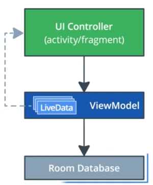

# Архитектура приложения (хранение данных)

## Оглавление

- [Введение](#введение)
- [Объявление объектов базы данных](#объявление-объектов-базы-данных)
- [Data Access Object](#data-access-object)
- [Создание базы данных `Room`](#создание-базы-данных-room)

## Введение

Продолжение урока об архитектуре приложения будет посвящено хранению данных и работе с базой данных.

По ходу урока будет доработано приложение "Sleep Tracker" помогающее следить за сном и его состоянием.  
На главном экране приложения располагаются кнопки "Start" и "Stop" для запуска таймера сна, а также список записей с информацией о сне. После остановки таймера сна приложение отображает экран "Quality", позволяющий оценить качество сна. После оценки, новая запись добавляется в список. Кнопка "Clear" на главном экране служит для очистки данных.


Архитектура приложения, использующего базу данных будет похожа на ту, что использовалась ранее. Единственное отличие заключается в том, что здесь **ViewModel** взаимодействует с базой данных **Room**.



`Room` — это высокоуровневый интерфейс для работы с базой данных SQLite, встроенный в Android. `Room` выполняет большую часть своей работы во время компиляции, создавая API-интерфейс поверх встроенного SQLite API, что избавляет от необходимости работать с устаревшими `Cursor` и `ContentResolver`.

В этом уроке будет рассмотрено как:

* Использовать `Room` для работы с базой данных.
* Создавать объект доступа к данным (DAO) и использовать его для выполнения запросов к БД.
* Использовать `Room` в рамках шаблона архитектуры MVVM.
* Ускорить работу с БД с помощью отдельных потоков (Coroutines).

**Обзор стартового кода приложения-примера:**

В Gradle-файле модуля `app` уже включены все необходимые зависимости: Room, Lifecycle Library, Coroutines.

```gradle
// Room and Lifecycle dependencies
implementation "androidx.room:room-runtime:$version_room"
kapt "androidx.room:room-compiler:$version_room"
implementation "androidx.lifecycle:lifecycle-extensions:$version_lifecycle_extensions"

// Coroutines
implementation "org.jetbrains.kotlinx:kotlinx-coroutines-core:$version_coroutine"
implementation "org.jetbrains.kotlinx:kotlinx-coroutines-android:$version_coroutine"
```

Код приложения сгруппирован в каталогах по функциональности. В каталоге `sleeptracker` содержатся классы, относящиеся к начальному экрану "Sleep Tracker". В каталоге `sleepquality` содержатся классы для функционала экрана "Sleep Quality". В каталоге `database` содержатся классы для работы с БД. Изначально они пустые.

Файл `Util.kt` содержит вспомогательные функции для работы со значениями качества сна, форматирования строки с датой и временем для отображения, а также закомментированный код, который использует экземпляр `ViewModel` и будет раскомментирован в ходе работы.

Данный урок предполагает, что читатель знаком с базами данных и SQL-синтаксисом.

## Объявление объектов базы данных

При использовании `Room` для работы с базой данных необходимо знание о двух основных понятиях: entities (объектах, сущностях) и queries (запросах).

Entity представляет собой объект или концепт, хранимый в базе данных. Entity-класс определяет таблицу базы данных, а каждый экземпляр такого класса — одну строку таблицы. Например, класс `Person`, описывающий таблицу `person` базы данных, будет являться entity-классом.

Query — это запрос на получение, добавление, изменение или удаление данных из таблицы или нескольких таблиц базы данных. Пример: запрос `SELECT` на получение всех записей из некоторой таблицы.

Использование `Room` значительно упрощает процесс объявления и использования entity-классов и запросов.

В приложении "Sleep Tracker" в качестве Entity-класса будет класс-модель `SleepNight`, содержащий информацию о сне: дату и время начала сна, дату и время его окончания, а также его качество. Кроме, этого в классе будет описано поле `nightId`, которое будет содержать идентификатор записи в таблице.

```kotlin
@Entity(tableName = "sleep_quality_table")
data class SleepNight(
    
    @PrimaryKey(autoGenerate = true)
    @ColumnInfo(name = "id")
    var nightId: Long = 0L,

    @ColumnInfo(name = "start_time_millis")
    val startTimeMillis: Long = System.currentTimeMillis(),

    @ColumnInfo(name = "end_time_millis")
    var endTimeMillis: Long = startTimeMillis,

    @ColumnInfo(name = "sleep_quality")
    var sleepQuality: Int = -1
)
```

Для объявления класса как описания таблицы базы данных используется аннотация `@Entity`, куда в качестве параметра передается имя таблицы. По общепринятому соглашению по именованию таблиц баз данных имя таблицы указывается с использованием подчеркивания в качестве разделителя между словами. Если в аннотации `@Entity` не указать вручную имя таблицы, тогда в качестве имени будет использоваться имя класса, однако оно не будет соответствовать соглашению об именовании таблиц баз данных.

Для объявления столбцов таблицы, достаточно просто описать свойства класса в его конструкторе. Таким образом столбцы таблицы будут иметь те же имена, что и поля класса. Однако, такие поля также не соответствуют соглашению об именовании, и поэтому используются аннотации `@ColumnInfo` с параметром `name` для указания имени столбца вручную с использованием подчеркиваний.

Аннотация `@PrimaryKey` используется для указания того, что поле является ключом таблицы. В данном случае это поле `nightId` типа `Long`. Также устанавливается параметр `autoGenerate`, определяющий, что новый ключ будет генерироваться автоматически при добавлении новой записи в таблицу.

Таким образом создается класс `SleepNight`, описывающий таблицу базы данных `sleep_quality_table` с 4-мя столбцами: `id`, `start_time_millis`, `end_time_millis` и `sleep_quality`.

## Data Access Object

Во время использования базы данных возникает необходимость выполнения запросов к ней, например, на добавление или изменение данных, на удаление данных, а также на получение данных из базы, а зачастую еще и на получение с определенными условиями. Чтобы упростить работу с базой данных и особенно с выполнением запросов к ней, было придумано понятие объекта доступа к данным или Data Access Object, или коротко DAO.

Обычно DAO-классы — это классы, содержащие методы для работы с базой данных и выполнения запросов к ней. Снаружи интерфейс таких классов выглядит как набор методов, выполняющих определенные операции (запросы к БД), а внутри же каждого из методов описана логика выполнения запроса к БД и получения ответа от нее.

Библиотека `Room` предлагает свое определение DAO-классов, вернее DAO-интерфейсов. Здесь описание DAO является описанием интерфейса с методами, а не класса. А основная логика выполнения запросов прячется за определением аннотаций.

`Room` предоставляет следующие DAO-аннотации: `@Insert`, `@Update`, `@Delete`, а также `@Query`. Первые три используются для выполнения SQL-запросов `INSERT`, `UPDATE` и `DELETE`. Аннотация `@Query` позволяет описать любой запрос, поддерживающийся в SQLite.

В приложении "Sleep Tracker" уже создан интерфейс `SleepDatabaseDao`, но он пуст. Необходимо добавить описание методов для:

* Добавления новой записи о сне.
* Обновления существующей записи о сне.
* Получения существующей записи по ее ключу.
* Удаления всех записей из БД.
* Получения всех записей о снах.
* Получения последней добавленной записи о сне.

**1. Добавление интерфейса с описанием DAO:**

Для добавления нового DAO-интерфейса необходимо создать новый интерфейс и пометить его аннотацией `@Dao`.

В стартовом приложении уже есть интерфейс `SleepDatabaseDao`, поэтому необходимо лишь добавить для него фигурные скобки блока интерфейса и аннотацию.

```kotlin
@Dao
interface SleepDatabaseDao {

}
```

**2. Добавление метода `insert()`:**

Метод, который будет выполнять добавление новой записи о сне в БД, будет называться `insert()`. В качестве параметра метод принимает экземпляр `SleepNight`, который описан как сущность (entity) нашей базы данных.  
Для того, чтобы этот метод выполнял запрос `INSERT` к БД, необходимо добавить к методу аннотацию `@Insert`. Во время компиляции проекта `Room` сгенерирует код по аннотации, который будет корректно выполнять запрос `INSERT` при вызове этого метода. Сгенерированный код, будет разбирать полученный объект `SleepNight` на строки таблицы, которой объект принадлежит и выполнять запрос.

```kotlin
@Insert
fun insert(night: SleepNight)
```

**3. Добавление метода `update()`:**

Для обновления записей в БД добавляется метод `update()` и помечается аннотацией `@Update`. Метод будет выполнять запрос `UPDATE` к базе данных. Все работает аналогично методу `insert()`.

```kotlin
@Update
fun update(night: SleepNight)
```

**4. Добавление метода `get()`:**

Метод для получения записи из базы по ее ключу будет называться `get()`. Поскольку ни `@Insert`, ни `@Update`, ни `@Delete`, не подходят для выполнения запроса `SELECT` на получение данных, поэтому здесь будет использоваться аннотация `@Query`.

```kotlin
@Query("SELECT * FROM sleep_quality_table WHERE id = :key")
fun get(key: Long): SleepNight?
```

Аннотация `@Query` принимает в качестве параметра строку с запросом, который необходимо выполнить. В данном случае — это запрос `SELECT *` на получение всех записей из таблицы `sleep_quality_table` с полем `id` равным переданному в метод параметру `key`. После компиляции также будет автоматически сгенерирован код по аннотации `Query`, который будут выполнять описанный в аннотации запрос к БД.

К слову, если SQL-запрос написан с ошибкой, то среда подкрасит запрос красным, но собрать проект будет возможно.

**5. Добавление метода `clear()`:**

Метод для удаления всех записей о сне из таблицы будет называться `clear()` и он также будет помечен аннотацией `@Query`. С описанием запроса.

```kotlin
@Query("DELETE FROM sleep_quality_table")
fun clear()
```

В данном случае не используется аннотация `@Delete` по той причине, что запрос эта аннотация используется для удаления лишь одной конкретной записи с указанием конкретного экземпляра `SleepNight` или списка экземпляров в качестве параметра метода. Здесь же запрос удаляет все данные из конкретной таблицы и его можно описать только с помощью аннотации `@Query`.

**6. Добавление метода `getAllNights()`:**

Метод для получения списка всех записей сна будет называться `getAllNights()` и будет возвращать объект `LiveData` со списком объектов `SleepNight`. К методу также добавлена аннотация `@Query`, описывающая запрос `SELECT` по получению записей из таблицы и сортировке данных по убыванию `id`. Таким образом самые новые записи будут самыми первыми.

```kotlin
@Query("SELECT * FROM sleep_quality_table ORDER BY id DESC")
fun getAllNights(): LiveData<List<SleepNight>>
```

Тип `LiveData` будет использоваться далее для отслеживания изменений в таблице БД и обновления вида. Возможность возвращать данные, обернутые в `LiveData` — одна из самых полезных функций `Room`.

**7. Добавление метода `getTonight()`:**

В завершении будет добавлен метод для получения последней добавленной записи `getTonight()`. Метод также будет помечен аннотацией `@Query` с описанием запроса. Запрос похож на тот, что описан в методе по получению всех записей. Отличие в том, что здесь используется параметр `LIMIT 1` для гарантированного получения лишь одной записи, а не списка.

```kotlin
@Query("SELECT * FROM sleep_quality_table ORDER BY id DESC LIMIT 1")
fun getTonight(): SleepNight?
```

Таким образом был описан DAO-интерфейс с использованием аннотаций библиотеки `Room`, упрощающих описание запросов к базе данных.  
В конце, чтобы убедиться, что сборка проходит и приложение не падает, можно его запустить.

## Создание базы данных `Room`

Теперь, когда созданы классы сущности (entity) и DAO, можно перейти к добавлению базы данных. Для этого необходимо реализовать абстрактный класс унаследованный от `RoomDatabase` помеченный аннотацией `@Database`.


Для создания класса базы данных необходимо:

* Создать абстрактный класс наследованный от `RoomDatabase`. Класс абстрактный, т.к. `Room` создаст его реализацию для на самостоятельно при компиляции.
* Пометить класс аннотацией `@Database` с передачей в качестве параметров список сущностей (entity) для создания таблиц БД, а также версии БД.
* Объявить абстрактный метод для получения экземпляром DAO-класса. `Room` также сгенерирует его реализацию.
* Сделать класс синглтоном, т.е. создать статическое поле с объектом текущего класса базы данных и метод инициализирующий и возвращающий его.

**1. Добавление абстрактного класса `SleepDatabase`:**

В стартовом приложении уже создан пустой файл `SleepDatabase.kt`. В него необходимо добавить объявление абстрактного класса `SleepDatabase` с аннотацией `@Database`.

```kotlin
@Database(entities = [SleepNight::class], version = 1, exportSchema = false)
abstract class SleepDatabase : RoomDatabase() {
}
```

В параметрах аннотации описывается:

* список сущностей (entities-классов); 
* версия базы данных, которая должна меняться, когда БД претерпевает изменения в разных версиях приложения;
* параметр `exportSchema`, определяющий должна ли схема БД быть экспортирована в каталог проекта. По умолчанию значение `true`, но в этом простейшем примере нет необходимости куда-то экспортировать схему БД.

**2. Добавление объявления абстрактного метода для получения экземпляра DAO:**

```kotlin
abstract fun getSleepDatabaseDao(): SleepDatabaseDao
```

**3. Добавление статического поля `SleepDatabase`:**

Далее предлагается сделать класс `SleepDatabaseDao` синглтоном, т.е. классом, хранящим собственный экземпляр внутри себя в виде статического поля. Таким образом состояние объекта будет одним и тем же во всем приложении независимо от класса, в котором `SleepDatabaseDao` используется. 

```kotlin
companion object {
    @Volatile
    private var INSTANCE: SleepDatabase? = null   
}
```

Статические классы и методы объявляются внутри блока `companion object`. Здесь объявляется поле `INSTANCE` типа `SleepDatabase`. Поле `INSTANCE` является экземпляром созданного класса базы данных.

Аннотация `@Volitile` помечает поле как поле доступное всем имеющимся потокам приложения. То есть это поле будет доступно в рамках всех потоков приложения, в том числе и основного UI-потока. Изменение поля помеченного `@Volitile` будет видно мгновенно во всех потоках. Таким образом можно избежать проблемы, когда два потока используют поле и его данные, но в одном потоке данные актуальны, а во втором не синхронизированы, что может приводить к проблемам.

**4. Добавление метода для получения экземпляра класса `SleepDatabase`:**

Для получения экземпляра синглтона `SleepDatabase` в рамках приложения необходимо добавить класс, который будет инициализировать поле `INSTANCE` если оно `null` и возвращать его, либо возвращать поле без инициализации, если объект уже был создан ранее.

```kotlin
fun getInstance(context: Context): SleepDatabase {
    synchronized(this) {
        var instance = INSTANCE
        if (instance == null) {
            instance = Room.databaseBuilder(context.applicationContext,
                    SleepDatabase::class.java, "sleep_tracker_db")
                    .build()
            INSTANCE = instance
        }
        return instance
    }
}
```

Метод `getInstance()` принимает на вход экземпляр класса `Context`, например, экземпляр активности. Контекст необходим для создания экземпляра класса БД `SleepDatabase` с помощью `Room`.  

Весь код метода описан в блоке `synchronized {}`. Если база данных, а следовательно и объект `SleepDatabase`, используется несколькими потоками, то описание блока `synchronized {}` позволяет выполнять кусок кода только в рамках одного потока. Остальные потоки будут дожидаться момента, когда первый поток закончит выполнение описанного блока, и только тогда код станет доступен для остальных потоков. Таким образом блок `sunchronized {}` позволяет избежать ошибок множественного доступа к синглтон-объекту разными потоками.

В рамках блока `synchronized {}` описывается инициализация поля `INSTANCE`. Сперва инициализируется временное поле `instance` значением поля `INSTANCE`. Далее проверяется было ли поле проинициализировано ранее, и если нет, то инициализируется с помощью вызова `Room.databaseBuilder().build()`. В качестве параметров передается контекст приложения, класс `SleepDatabase` и имя файла базы данных, которое должно быть присвоено.

После создания экземпляра БД во временной переменной, переписываем ее в поле `INSTANCE` и возвращаем значение временной переменной. Таким образом метод `getInstance()` позволяет получать экземпляр класса базы данных `SleepDatabase`. При этом, если экземпляр не был создан ранее, он будет создан.

Манипуляции с временными переменными используются для того, чтобы избежать ситуации, когда в процессе выполнения метода поле какой-нибудь из потоков изменит значение поля `INSTANCE` на `null`. Если не использовать временной переменной, то компилятор не позволит собрать такой код.

Таким образом синглтон-создается класс для инициализации и доступа к базе данных. Код должен успешно собираться, однако пока неясно работает ли он.

**5. Тестирование работоспособности класса базы данных `SleepDatabase` и DAO:**

Для проверки работоспособности кода можно выполнить уже добавленные в стартовый код тест. Для этого необходимо перейти в файл `SleepDatabaseTest.kt` и раскомментировать весь код.

Код тестов содержит метод `createDb()` помеченный аннотацией `@Before`. Аннотация объявляет данный метод как тот, что будет вызван перед выполнением каждого теста. Здесь инициализируется объект `SleepDatabase` с помощью метода `inMemoryDatabaseBuilder()`. Метод создаст временную БД, которая будет хранится в памяти устройства и будет удалена автоматически после завершения тестов. Метод `allowMainThreadQueries()` позволяет выполнять запросы к БД на главном потоке приложения. По умолчанию это не разрешено, т.к. выполнение запросов на главном потоке блокирует выполнение остальных операций. Вызов же метода `allowMainThreadQueries()` разрешает выполнение запросов на главном потоке. Однако, когда запросов становится много это может значительно замедлять работу приложения.

Метод `closeDb()` выполняет закрытие соединения с БД и т.к. он помечен аннотацией `@After` он будет выполнен после каждого теста.

Метод же помеченный аннотацией `@Test` является методом-тестом. Здесь такой метод проверяет корректность работы DAO по добавлению новой записи в БД. Метод создает новый объект `SleepNight`, использует объект DAO для выполнения запроса `INSERT` к БД, затем достает из БД последнюю добавленную запись и проверяет значение ее поля `sleepQuality` на соответствие значению по умолчанию, т.к. вручную значение для поля не задавалось.

Для запуска тестов необходимо нажать на файле правой кнопкой мыши и выбрать `Run`.

// In Progress
