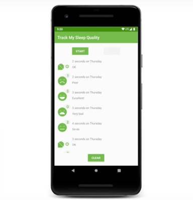
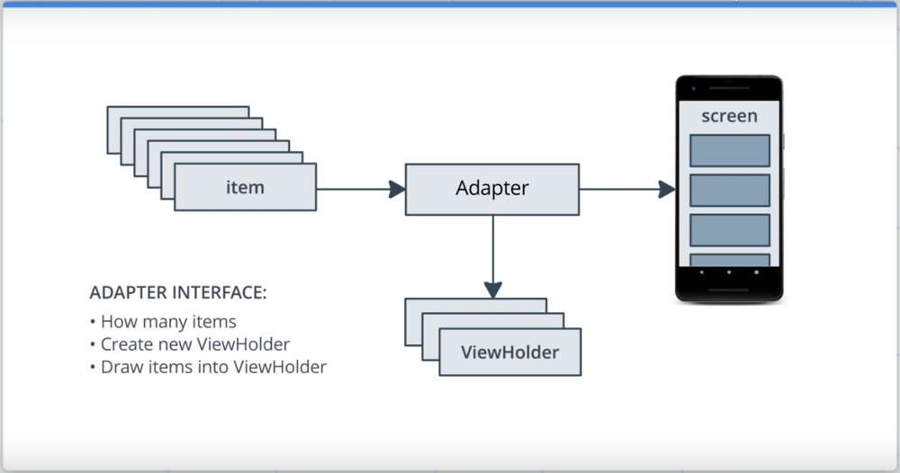
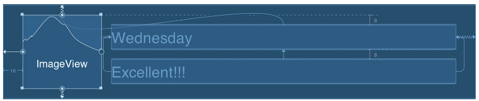

# RecyclerView

## Оглавление

- [Введение](#введение)
- [Шаблон проектирования "Адаптер"](#шаблон-проектирования-адаптер)
- [Добавление `RecyclerView`](#добавление-recyclerview)
- [Отображение записей `SleepNight` в списке `RecyclerView`](#отображение-записей-sleepnight-в-списке-recyclerview)
- [Рефакторинг класса `SleepNightAdapter`](#рефакторинг-класса-sleepnightadapter)

## Введение

Отображение списка данных является одной из самых распространенных задач пользовательского интерфейса в Android. В погодном приложении отображается список прогнозов. В приложении чата отображается список сообщений. В новостном приложении — список новостей. Почти каждое приложение имеет хотя бы один список.

Списки как могут быть простыми, где каждый элемент — это просто компонент `TextView`. А могут быть и сложными с элементами, состоящими из множества компонентов.

Для реализации разных вариантов списков, как простых так и сложных, в Android используется компонент `RecyclerView`. У `RecyclerView` есть несколько преимуществ.

Во-первых, `RecyclerView` разработан так, что он работает со списками максимально эффективно, даже когда в списке находится большое число элементов.  
Во-вторых, `RecyclerView` позволяет отображать элементы разной сложности одновременно. Это могут быть как простые `TextView`-элементы, так и сложные элементы с текстом, изображениями или видео внутри.  
В-третьих, `RecyclerView` поддерживает возможность отображения и списков, и сетки (Grid) из элементов.  
В-четвертых, `RecyclerView` позволяет настраивать ориентацию скроллинга: вертикально или горизонтально.

Эффективность `RecyclerView` заключается в том, что он использует адаптеры (о них речь пойдет далее) для отрисовки элементов списка. По умолчанию `RecyclerView` отрисовывает только элементы, видимые пользователю на экране. Это означает, что если в списке 1000 элементов, а пользователю видны только 10 из них, то `RecyclerView` будет отрисовывать только 10 элементов из 1000. А во время скроллинга будет автоматически обновлять содержимое элементов новых элементов, которые пользователю становятся видны. Таким образом `RecyclerView` просто переиспользует существующие элементы, чтобы обновить отображение, вместо полного их пересоздания. Кроме этого, когда обновляется какой-либо элемент списка (например, в результате работ фоновых процессов), то `RecyclerView` не будет обновлять весь список целиком, а обновит только один конкретный элемент.

Кроме `RecyclerView` Android предоставляет и другие компоненты для отображения списков.  
Например, `ListView` и `GridView`. Они более просты в использовании, чем `RecyclerView`, однако они менее настраиваемые, и эффективно работают лишь с небольшим количеством элементов в списке, не более 100.
Также есть `LinearLayout`, однако, он не подходит для отображения большого числа элементов, отображение которых должно выполняться автоматически. `LinearLayout` подходит лишь для отображения статических компонентов, количество которых меняться не должно.  
Таким образом, на текущий момент наиболее подходящим решением для отображения списка элементов является `RecyclerView`.

В данном уроке мы будем добавлять `RecyclerView` в приложение "Sleep Tracker", разработанное в предыдущем уроке. Сейчас приложение отображает список данных, но отображает их с помощью постоянно генерирующейся строки. Это ужасно выглядит с точки зрения пользовательского интерфейса, и ужасно реализовано как с точки зрения производительности (строка постоянно генерируется заново), так и с точки зрения чистоты кода.

Для отображения списка элементов будет использоваться `RecyclerView` и будут реализованы элементы списка, отображающие время сна, его продолжительности, оценку и иконку оценки.



## Шаблон проектирования "Адаптер"

В этом уроке будет рассмотрен еще один шаблон проектирования — "Адаптер". Он потребуется для правильной реализации работы с `RecyclerView`.

`RecyclerView` служит для отображения большого количества однотипных данных. Прежде чем отобразить данные, кто-то должен их подготовить для отображения, создать отдельные элементы списка и поместить на них данные. Этим занимается адаптер.

В случае с приложением "Sleep Tracker" данные хранятся в базе данных `Room`. Адаптер необходим для адаптации и подготовки данных к отображению в `RecyclerView`.

Адаптер должен предоставлять для `RecyclerView`:

* Информацию о количестве доступных элементов.
* Информацию о том, каким образом элементы списка должны быть отрисованы.
* Способ создания нового вида для элементов списка.

Когда `RecyclerView` запущен, он опрашивает адаптер о том, как много элементов он должен содержать. Затем узнает каким образом первый элемент должны быть отрисован на экране и отрисовывает его. Затем узнает как отрисовать второй элемент и отрисовывает его тоже, и т.д до тех пор пока место на экране не закончится. В этот момент `RecyclerView` заканчивает отрисовку элементов. 

Когда пользователь начинает скроллить экран, элемент, скрывающийся от пользователя, переиспользуется для создания нового элемента, который пользователю показывается во время скроллинга.

Для использования такого пересоздания экземпляров и поддержки сложных видов для элементов списка `RecyclerView` использует "холдеры видов" `ViewHolder`.

`ViewHolder`:

* Содержит в себе информацию о виде элемента списка.
* Хранит важную информацию для эффективной работы `RecyclerView`, например, последнюю позицию текущего элемента в списке.
* Является интерфейсом для элементов `RecyclerView`.

Можно подвести небольшое резюме касательно шаблона "Адаптер".  
Наше приложение имеет некоторый список элементов (записей о снах). Адаптер будет подготавливать элементы списка для отрисовки их на экране. Отображаться элементы будут на `RecyclerView`. `RecyclerView` может запрашивать количество элементов, которые нужно отобразить, у адаптера. Также он будет запрашивать у адаптера новый экземпляр `ViewHolder` для каждого элемента, который должен быть отрисован. Для эффективности `RecyclerView` будет переиспользовать `ViewHolder`'ы, которые скрываются с экрана в процессе скроллинга.



Далее перейдем к добавлению `RecyclerView`-, `Adapter-` и `ViewHolder`-классов шаг за шагом.

## Добавление `RecyclerView`

Перейдем к добавлению `RecyclerView` на макет фрагмента `SleepTrackerFragment` и реализации класса-адаптера.

**1. Добавление `RecyclerView` в файл `fragment_sleep_tracker.xml`:**

На текущий момент макет `fragment_sleep_tracker.xml` содержит компонент `ScrollView` с `TextView` внутри. Наша задача — заменить `ScrollView` на `RecyclerView`. Именно он будет отображать список элементов.

```kotlin
<androidx.recyclerview.widget.RecyclerView
    android:id="@+id/sleep_list"
    android:layout_width="0dp"
    android:layout_height="0dp"
    app:layout_constraintBottom_toTopOf="@+id/clear_button"
    app:layout_constraintEnd_toEndOf="parent"
    app:layout_constraintStart_toStartOf="parent"
    app:layout_constraintTop_toBottomOf="@+id/stop_button"
    app:layoutManager="androidx.recyclerview.widget.LinearLayoutManager"/>
```

Компонент `RecyclerView` имеет идентификатор `sleep_list`. Он потребуется позже. Кроме этого компонент располагается внутри `ConstraintLayout`, поэтому для него нет необходимости строго настраивать ширину и высоту, но обязательно настраиваются "привязки" к краям экрана слева и справа, а также к кнопке "Stop" сверху и кнопке "Clear" снизу. Список записей располагается между этими кнопками. В конце настраивается параметр `layoutManager`. На вход параметр принимает имя класса `LinearLayoutManager`, который определяет расположение элементов внутри `RecyclerView` и политику взаимодействия с ними. Кроме `LinearLayoutManager` это могут быть также `GridLayoutManager`, `StaggeredGridLayoutManager` и `WearableLinearLayoutManager`. `LinearLayoutManager` определяет, что элементы внутри `RecyclerView` будут располагаться в виде списка.

**2. Добавление класса `SleepNightAdapter`:**

Для добавления адаптера необходимо создать новый класс `SleepNightAdapter`. Он должен наследоваться от шаблонного класса `RecyclerView.Adapter<>` и в качестве шаблона указывается класс `ViewHolder`.

```kotlin
class SleepNightAdapter : RecyclerView.Adapter<TextItemViewHolder>() {
}
```

**3. Добавление класса `TextItemViewHolder`:**

Для тестов нам необходимо просто отобразить текст в элементах списка, поэтому создадим простейший `TextItemViewHolder` с элементом `TextView` внутри. 

```kotlin
class TextItemViewHolder(val textView: TextView): RecyclerView.ViewHolder(textView)
```

Добавленный код компилятор не соберет, поскольку необходимо переопределить несколько методов класса-адаптера, чтобы предоставить `RecyclerView` информацию о данных и видах элементов.

**4. Добавление данных в адаптер:**

Для начала добавим свойство `data`, которое будет являться списком объектов `SleepNight`. Это будут данные для `RecyclerView`.

```kotlin
var data = listOf<SleepNight>()
    set(value) {
        field = value
        notifyDataSetChanged()
    }
```

Для свойства `data` определим сеттер, который будет не только сохранять новое значение свойства, но и вызывать метод адаптера `notifyDataSetChanged()`. Данный метод оповещает `RecyclerView` о том, что данные изменились и `RecyclerViwe` получая такое сообщение автоматически перерисовывает свое содержимое.

Далее необходимо предоставить информацию о том, сколько элементов будет содержаться в `RecyclerView`. Для этого необходимо переопределить метод `getItemCount()`, чтобы он возвращал общее число элементов в списке `data`.

```kotlin
override fun getItemCount() = data.size
```

**5. Предоставление информации об отрисовке элементов списка:**

Далее необходимо предоставить информацию о том, каким образом элементы должны быть отрисованы. Для этого переопределяется метод `onBindViewHolder()`. Он принимает на вход два параметра: `ViewHolder` (в нашем случае `TextItemViewHolder`) и позицию элемента. Метод `onBindViewHolder()` будет вызван `RecyclerView` для отображения данных на элементе с определенной позицией в списке.

```kotlin
override fun onBindViewHolder(holder: TextItemViewHolder, position: Int) {
    val item = data[position]
    holder.textView.text = item.sleepQuality.toString()
}
```

Для обновления данных на элементе `TextItemViewHolder` необходимо сперва получить экземпляр модели `SleepNight` из списка `data` по позиции. А затем получить, например, значение `sleepQuality` и записать его в `TextView` "холдера", который отвечает за отображение элемента в списке. Значение `sleepQuality` используется исключительно для демонстрации того, как получить данные и поместить их в вид элемента списка.

Таким образом мы создали адаптер и настроили для `RecyclerView` возможность получения информации о количестве элементов, и о том, как данные должны помещаться на вид каждого из элементов. 

**6. Добавление метода создания экземпляров `TextItemViewHolder`:**

Далее перейдем к переопределению метода для создания экземпляров `ViewHolder` — `onCreateViewHolder()`.

```kotlin
override fun onCreateViewHolder(parent: ViewGroup, viewType: Int): TextItemViewHolder {
    val layoutInflater = LayoutInflater.from(parent.context)
    val view = layoutInflater
            .inflate(R.layout.text_item_view, parent, false) as TextView
    return TextItemViewHolder(view)
}
```

Метод принимает на вход два параметра. Первый — родительский UI-элемент типа `ViewGroup`, куда будет помещен создаваемый `ViewHolder`. В нормальной ситуации это именно компонент `RecyclerView`. Второй параметр — тип, используемый, когда `RecyclerView` отображает визуальные элементы разных типов и видов. Например, когда `RecyclerView` может отображать в одном списке элементы с текстом, и элементы с изображениями одновременно.

Точно так же как и для инициализации вида фрагментов, здесь для инициализации вида `ViewHolder` используется `LayoutInflater` и метод `inflate()`. Метод `inflate()` загружает макет вида элемента списка, инициализирует его и возвращает. В данном случае вид элемента списка — это экземпляр класса `TextView`. В конце возвращаем новый экземпляр "холдера" `TextItemViewHolder`. Конструктор `TextItemViewHolder` принимает на вход экземпляр `TextView`, передаем экземпляр полученный вызовом `inflate()`.

Загружаемый макет `text_item_view.xml` "холдера" содержит лишь один компонент `TextView`.

```xml
<?xml version="1.0" encoding="utf-8"?>
<TextView xmlns:android="http://schemas.android.com/apk/res/android"
    android:textSize="24sp"
    android:paddingStart="16dp"
    android:paddingEnd="16dp"
    android:layout_width="match_parent"
    android:layout_height="wrap_content" />
```

Таким образом мы подготовили метод для создания экземпляров `ViewHolder`-компонентов, которые будут использоваться `RecyclerView` для отображения в списке. Сам `RecyclerView` ничего не знает том, как выглядят элементы внутри него. Он лишь запрашивает адаптер на создание элементов, а адаптер уже предоставляет всю информацию об элементах: их количестве, создании "холдеров" и об отрисовке данных на "холдерах".

**7. Установка адаптера для `RecyclerView`:**

Осталось создать экземпляр адаптера и установить его для добавленного ранее `RecyclerView`. Для этого необходимо в классе `SleepTrackerFragment` в методе `onCreateView()` добавить инициализацию адаптера и установку с помощью поля `binding`.

```kotlin
// SleepTrackerFragment.onCreateView()

val adapter = SleepNightAdapter()
binding.sleepList.adapter = adapter
```

Таким образом адаптер установлен в `RecyclerView` и все данные из адаптера автоматически будут отображаться в `RecyclerView` с помощью `ViewHolder`-компонентов.

Чтобы адаптер содержал некоторые данные необходимо проинициализировать его поле `data`, когда данные в БД меняются. Поскольку доступ к данным в БД осуществляется через объект `ViewModel`, то необходимо добавить подписку на изменение этих данных.

```kotlin
viewModel.nights.observe(viewLifecycleOwner, Observer { nights ->
    if (nights != null)
        adapter.data = nights
})
```

Если запустить приложение, то можно убедиться, что при нажатии кнопки "Start" в список на экране добавляется один элемент, отображающий "-1" — это оценка сна по умолчанию. После нажатия кнопки "Stop" открывается экран выбора оценки и после выбора запись на странице со списком обновляется и отображает ту оценку, что выбрал пользователь. Этот тест показывает, что добавленный `RecyclerView` работает. Он получает данные из адаптера (который в свою очередь получает их из БД через `ViewModel`). Адаптер и `ViewHolder` также предоставляют для `RecyclerView` информацию о том, как должны выглядеть элементы списка и как их создать.

**8. Повторное использование экземпляров `ViewHolder`:**

Чтобы продемонстрировать каким образом элементы списка `RecyclerView` переипользуются, необходимо добавить условие, что если качество сна менее двойки, то окрашивать оценку сна красным цветом. 

```kotlin
override fun onBindViewHolder(holder: TextItemViewHolder, position: Int) {
    val item = data[position]
    if (item.sleepQuality < 2) {
        holder.textView.setTextColor(Color.RED)
    }
    holder.textView.text = item.sleepQuality.toString()
}
```

Если запустить приложение и добавить столько элементов в список, что они не будут помещаться на экране все одновременно, то  можно заметить при добавлении новых элементов, что уже ранее добавленные элементы с оценкой 2 и выше окрашиваются красным, хотя не должны. Это происходит из-за переиспользования экземпляров `ViewHolder`-объектов, у которых уже установлен цвет, но переопределяется значение текста. Чтобы избежать подобных проблем, нужно сбрасывать состояние элементов в состояние по умолчанию. 

В данном случае, необходимо для элементов с оценкой 3 и выше устанавливать черный цвет текста.

```kotlin
if (item.sleepQuality < 2) {
    holder.textView.setTextColor(Color.RED)
} else {
    holder.textView.setTextColor(Color.BLACK)
}
```

Теперь при запуске приложения и добавлении новых элементов можно заметить, что проблемы с неверным окрашиванием элементов списка нет.

## Отображение записей `SleepNight` в списке `RecyclerView`

В предыдущей главе научились добавлять `RecyclerView` с адаптером и `ViewHolder`'ом для отображения конкретных данных на отдельных элементах списка. В этой главе подробнее пойдет речь о `ViewHolder`'ах, о создании собственного сложного `ViewHolder`-класса.

Прежде чем создавать собственный сложный `ViewHolder`-класс рассмотрим класс `TextItemViewHolder`, что используется на данный момент.

```kotlin
class TextItemViewHolder(val textView: TextView): RecyclerView.ViewHolder(textView)
```

Класс наследуется от `RecyclerView.ViewHolder`, имеет лишь одной свойство `textView` и не имеет тела. То есть вся реализация данного класса заключается в реализации его родителя `RecyclerView.ViewHolder`.

Если заглянуть в реализацию или [документацию](https://developer.android.com/reference/android/support/v7/widget/RecyclerView.ViewHolder) класса `RecyclerView.ViewHolder`, можно найти свойства и методы, общие для `ViewHolder`-классов.

Например, каждый `ViewHoler` содержит свойство `itemView`. Объект `itemView` который является видом элемента списка и экземпляром класса `View`, который должен быть отображен внутри `RecyclerView`. В случае с `TextItemViewHolder` таким видом является `TextView`, который передается в конструктор класса.

Перейдем к созданию собственного `ViewHolder`-класса.

**1. Добавление макета для `ViewHolder`:**

Сперва необходимо добавить макет элемента списка, который будет макетом для нового `ViewHolder`-класса. Файл с макетом будет называться `list_item_sleep_night.xml`.

Макет должен содержать один элемент `ImageView` для отображения иконки оценки сна и два текстовых поля `TextView` для отображения даты сна и текстового представления оценки.



Компонент `ImageView` для отображения иконки:

```xml
<ImageView
    android:id="@+id/quality_image"
    android:layout_width="@dimen/icon_size"
    android:layout_height="60dp"
    android:layout_marginStart="16dp"
    android:layout_marginTop="8dp"
    android:layout_marginBottom="8dp"
    app:layout_constraintBottom_toBottomOf="parent"
    app:layout_constraintStart_toStartOf="parent"
    app:layout_constraintTop_toTopOf="parent" 
    tools:srcCompat="@drawable/ic_sleep_5"/>
```

Компонент `TextView` для отображения даты сна:

```xml
<TextView
    android:id="@+id/sleep_length"
    android:layout_width="0dp"
    android:layout_height="20dp"
    android:layout_marginStart="8dp"
    android:layout_marginTop="8dp"
    android:layout_marginEnd="16dp"
    app:layout_constraintEnd_toEndOf="parent"
    app:layout_constraintStart_toEndOf="@+id/quality_image"
    app:layout_constraintTop_toTopOf="@+id/quality_image"
    tools:text="Wednesday" />
```

Компонент `TextView` для отображения текстового представления оценки:

```xml
<TextView
    android:id="@+id/quality_string"
    android:layout_width="0dp"
    android:layout_height="20dp"
    android:layout_marginTop="8dp"
    app:layout_constraintEnd_toEndOf="@+id/sleep_length"
    app:layout_constraintStart_toStartOf="@+id/sleep_length"
    app:layout_constraintTop_toBottomOf="@+id/sleep_length"
    tools:text="Excellent!!!" />
```

Подробно на каждом атрибуте останавливаться не будем. Все было рассмотрено в предыдущих уроках.

**2. Создание класса `SleepNightViewHolder`:**

Далее необходимо создать класс `SleepNightViewHolder` и унаследовать его от `RecyclerView.ViewHolder`.

```kotlin
class SleepNightViewHolder(itemView: View) : RecyclerView.ViewHolder(itemView) {
    val qualityImage: ImageView = itemView.findViewById(R.id.quality_image)
    val sleepLength: TextView = itemView.findViewById(R.id.sleep_length)
    val quality: TextView = itemView.findViewById(R.id.quality_string)
}
```

Класс содержит свойства `qualityImage`, `sleepLength` и `quality`, которе инициализируются с помощью `findViewById()` и являются компонентами, которые добавлялись на макет элемента списка `list_item_sleep_night.xml`.

**3. Использование `SleepNightViewHolder` в классе `SleepNightAdapter`:**

Далее необходимо заменить использование `TextItemViewHolder` в классе `SleepNightAdapter` на использование `SleepNightViewHolder`.

Во-первых, необходимо обновить метод `onCreateViewHolder()`: заменить тип возвращаемого значения, ссылку на ресурс с макетом "холдера" и создание экземпляра "холдера".

```kotlin
override fun onCreateViewHolder(parent: ViewGroup, viewType: Int): SleepNightViewHolder {
    val layoutInflater = LayoutInflater.from(parent.context)
    val view = layoutInflater
            .inflate(R.layout.list_item_sleep_night, parent, false)
    return SleepNightViewHolder(view)
}
```

Во-вторых, требуется обновить реализацию метода `onBindViewHolder()`. Метод должен принимать на вход экземпляр `SleepNightViewHolder` и настраивать его вид в соответствии с данными.

```kotlin
override fun onBindViewHolder(holder: SleepNightViewHolder, position: Int) {
    val item = data[position]
    val res = holder.itemView.context.resources
    holder.sleepLength.text = convertDurationToFormatted(item.startTimeMillis, item.endTimeMillis, res)
    holder.quality.text = convertNumericQualityToString(item.sleepQuality, res)
    holder.qualityImage.setImageResource(when (item.sleepQuality) {
        0 -> R.drawable.ic_sleep_0
        1 -> R.drawable.ic_sleep_1
        2 -> R.drawable.ic_sleep_2
        3 -> R.drawable.ic_sleep_3
        4 -> R.drawable.ic_sleep_4
        5 -> R.drawable.ic_sleep_5
        else -> R.drawable.ic_sleep_active
    })
}
```

Метод выполняет настройку текстовых полей `sleepLength` и `quality`, используя статические функции из файла `Util.kt`. Функция `convertNumericQualityToString()` уже добавлена заранее. А функцию `convertDurationToFormatted()` необходимо добавить вручную. Ее исходный код можно взять [здесь](https://github.com/udacity/andfun-kotlin-sleep-tracker-with-recyclerview/blob/Step.04-Solution-Display-SleepQuality-List/app/src/main/java/com/example/android/trackmysleepquality/Util.kt#L51). Кроме этого требуется добавить строки:

```xml
<string name="minutes_length">%d minutes on %s</string>
<string name="hours_length">%d hours on %s</string>
<string name="seconds_length">%d seconds on %s</string>
```

И ресурс с иконкой `ic_sleep_active` [отсюда](https://github.com/udacity/andfun-kotlin-sleep-tracker-with-recyclerview/blob/Step.04-Solution-Display-SleepQuality-List/app/src/main/res/drawable/ic_sleep_active.xml).

Кроме настройки текстовых полей, метод выполняет установку иконки оценки сна из ресурсов, в зависимости от значения поля `sleepQuality` записи данных.

Если запустить приложение, то можно удостовериться, что код работает. `RecyclerView` отображает список из элементов, где каждый элемент обладает видом, созданного класса `SleepNightViewHolder`. При добавлении новых записей иконки и текст на элементах обновляется.

## Рефакторинг класса `SleepNightAdapter`

// In Progress 


